# ugv_ws 工作空间说明（穩定）

1.环境

- pc 软件：VMware Workstation 17Pro、mobarxterm
- 小车 版本：ugv rpi

2.架构

- 项目：https://github.com/DUDULRX/ugv_ws/tree/ros2-humble
    
    ```jsx
    git clone -b ros2-humble-develop https://github.com/DUDULRX/ugv_ws.git
    ```
    
    - 虚拟机第一次编译（小车上得一个一个编译）
        
        ```jsx
        cd /home/ws/ugv_ws
        . build_first.sh
        ```
        
        build_first.sh内容
        
        ```jsx
        cd /home/ws/ugv_ws
        colcon build --packages-select apriltag apriltag_msgs apriltag_ros cartographer costmap_converter_msgs costmap_converter emcl2 explore_lite openslam_gmapping slam_gmapping ldlidar rf2o_laser_odometry robot_pose_publisher teb_msgs teb_local_planner vizanti vizanti_cpp vizanti_demos vizanti_msgs vizanti_server ugv_base_node ugv_interface
        colcon build --packages-select ugv_bringup ugv_chat_ai ugv_description ugv_gazebo ugv_nav ugv_slam ugv_tools ugv_vision ugv_web_app --symlink-install 
        echo "source /opt/ros/humble/setup.bash" >> ~/.bashrc
        echo "eval "$(register-python-argcomplete ros2)"" >> ~/.bashrc
        echo "eval "$(register-python-argcomplete colcon)"" >> ~/.bashrc
        echo "source /home/ws/ugv_ws/install/setup.bash" >> ~/.bashrc
        source ~/.bashrc 
        ```
        
    - 虚拟机日常编译（小车上得一个一个编译）
        
        ```jsx
        cd /home/ws/ugv_ws
        . build_common.sh
        ```
        
        build_common.sh内容
        
        ```jsx
        cd /home/ws/ugv_ws
        colcon build --packages-select apriltag apriltag_msgs apriltag_ros cartographer costmap_converter_msgs costmap_converter emcl2 explore_lite openslam_gmapping slam_gmapping ldlidar rf2o_laser_odometry robot_pose_publisher teb_msgs teb_local_planner vizanti vizanti_cpp vizanti_demos vizanti_msgs vizanti_server ugv_base_node ugv_interface
        colcon build --packages-select ugv_bringup ugv_chat_ai ugv_description ugv_gazebo ugv_nav ugv_slam ugv_tools ugv_vision ugv_web_app --symlink-install 
        source install/setup.bash 
        ```
        
    - 编译apriltag
        
        ```jsx
        cd /home/ws/ugv_ws
        . build_apriltag.sh
        ```
        
        build_apriltag.sh内容
        
        ```jsx
        cd /home/ws/ugv_ws/src/ugv_else/apriltag_ros/apriltag
        cmake -B build -DCMAKE_BUILD_TYPE=Release
        cmake --build build --target install
        cd /home/ws/ugv_ws
        ```
        
- ubuntu 软件：
    
    **参照wiki安装 ros2 humble**
    
    ```jsx
    apt-get update 
    apt-get upgrade 
    
    apt install python3-pip
    apt-get install alsa-utils
    apt install python3-colcon-argcomplete
    
    apt install ros-humble-cartographer-*
    apt install ros-humble-desktop-*
    apt install ros-humble-joint-state-publisher-*
    apt install ros-humble-nav2-*
    apt install ros-humble-rosbridge-*
    apt install ros-humble-rqt-*
    apt install ros-humble-rtabmap-*
    apt install ros-humble-usb-cam
    apt install ros-humble-depthai-*
    
    #仿真 虚拟机安装
    apt install gazebo
    apt install ros-humble-gazebo-*
    ```
    
- python3 库：
    
    国内
    
    ```jsx
    cd ~/ugv_ws
    python3 -m pip install -r requirements.txt -i https://pypi.tuna.tsinghua.edu.cn/simple
    ```
    
    国外
    
    ```jsx
    cd ~/ugv_ws
    python3 -m pip install -r requirements.txt
    ```
    
    requirements.txt 内容
    
    ```jsx
    pyserial
    flask
    mediapipe
    requests
    ```
    
- ugv_ws 功能包
    
    > ugv_main 主要功能
    > 
    > 
    > > ugv_base_node 两轮差速 运动学
    > > 
    > 
    > > ugv_bringup 驱动、控制
    > > 
    > 
    > > ugv_chat_ai web ai交互
    > > 
    > 
    > > ugv_description 模型
    > > 
    > 
    > > ugv_gazebo 仿真
    > > 
    > 
    > > ugv_interface 信息接口
    > > 
    > 
    > > ugv_nav 导航
    > > 
    > 
    > > ugv_slam 建图
    > > 
    > 
    > > ugv_tools 工具
    > > 
    > 
    > > ugv_vision 视觉交互
    > > 
    > 
    > > ugv_web_app web端
    > > 
    
    > ugv_else ( ugv_main 依赖)
    > 
    > 
    > > apriltag_ros
    > > 
    > 
    > > cartographer
    > > 
    > 
    > > costmap_converter
    > > 
    > 
    > > emcl_ros2
    > > 
    > 
    > > explore_lite
    > > 
    > 
    > > gmapping
    > > 
    > 
    > > ldlidar
    > > 
    > 
    > > rf2o_laser_odometry
    > > 
    > 
    > > robot_pose_publisher
    > > 
    > 
    > > teb_local_planner
    > > 
    > 
    > > vizanti
    > > 

3.使用（小车上的ros包均在docker内执行）

use_rviz 可选 true、false(默认)

小车模型 可选 rasp_rover、ugv_rover、ugv_beast

雷达模型 可选 ld06、ld19(默认)、stl27l

- 启动小车，关闭开机自启动脚本
    
    ```jsx
    sudo killall -9 python
    ```
    

进入docker，启动ssh，方可远程到docker，可视化界面

- 小车设置docker
    - 设置docker远程登陆
        
        主机中执行，进入目录
        
        ```jsx
        cd /home/ws/ugv_ws
        sudo chmod +x ros2_humble.sh remotessh.sh
        ./ros2_humble.sh
        ```
        
        1进入docker
        
        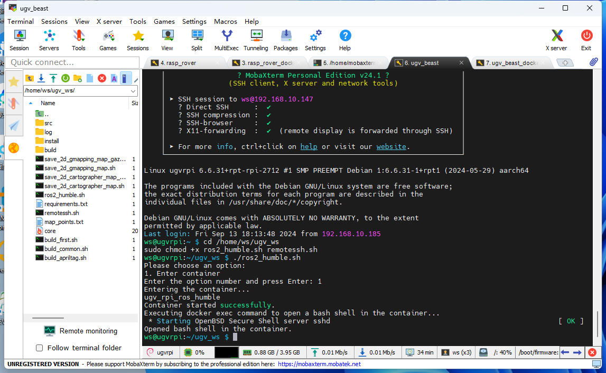
        
    - 退出docker
        
        docke内执行
        
        ```jsx
        exit
        ```
        
- 远程到docker
    
    
    
    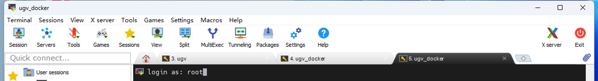
    
    ```jsx
    #用户名
    root
    #密码需提前设置
    ws
    ```
    
    进入工作空间
    
    ```jsx
    cd /home/ws/ugv_ws
    ```
    
- 查看模型关节
    - rasp_rover
        
        ```jsx
        export UGV_MODEL=rasp_rover
        ```
        
        启动
        
        ```jsx
         ros2 launch ugv_description display.launch.py use_rviz:=true
        ```
        
        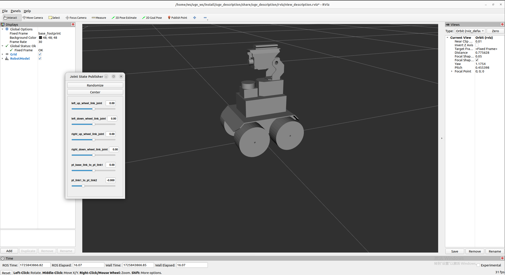
        
    - ugv_rover
        
        ```jsx
        export UGV_MODEL=ugv_rover
        ```
        
        启动
        
        ```jsx
         ros2 launch ugv_description display.launch.py use_rviz:=true
        ```
        
        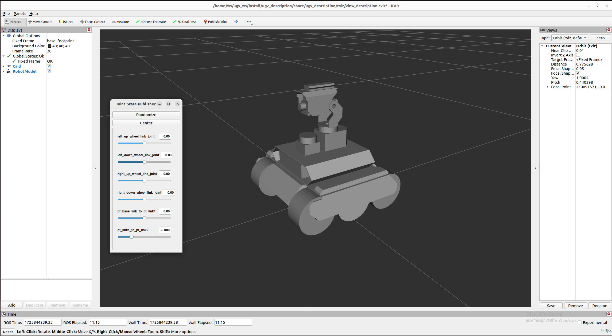
        
    - ugv_beast
        
        ```jsx
        export UGV_MODEL=ugv_beast
        ```
        
        启动
        
        ```jsx
         ros2 launch ugv_description display.launch.py use_rviz:=true
        ```
        
        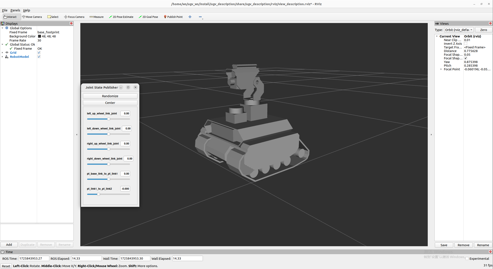
        
    - 驱动小车（可以控制云台、LED灯）
        
        ```jsx
         ros2 run ugv_bringup ugv_driver
        ```
        
        拖动关节角度发布器相关滑条可以控制云台
        
        [](https://youtu.be/jA9LJTBRQqY "")
        
        控制灯光 data 0-255  data[0]控制oak相机附近灯IO4  data[1]控制usb摄像头附近灯IO5 
        
        ```jsx
        ros2 topic pub /ugv/led_ctrl std_msgs/msg/Float32MultiArray "{data: [0, 0]}" -1
        ```
        
- 底盘驱动（docker内执行）
    
    如改用另外的雷达，修改
    
    ```jsx
    export LDLIDAR_MODEL=
    ```
    
    - 直接使用imu传感器数据（长时间会漂移）
        
        ```jsx
        ros2 launch ugv_bringup bringup_imu_origin.launch.py use_rviz:=true
        ```
        
    - 使用imu和odom进行ekf融合（不能长时间原地大幅度旋转）
        
        ```jsx
        ros2 launch ugv_bringup bringup_imu_ekf.launch.py use_rviz:=true
        ```
        
    - 使用雷达作为imu传感器数据（稳定些）
        
        ```jsx
        ros2 launch ugv_bringup bringup_lidar.launch.py use_rviz:=true
        ```
        
    
    原地旋转小车查看姿态
    
    [](https://youtu.be/5neLr1Q2ddM "")
    
- 手柄、键盘控制
    
    启动小车
    
    ```jsx
    ros2 launch ugv_bringup bringup_lidar.launch.py use_rviz:=true
    ```
    
    - 手柄控制（手柄usb接口需接在小车或虚拟机）
        
        ```jsx
        ros2 launch ugv_tools teleop_twist_joy.launch.py
        ```
        
    - 键盘控制
        
        ```jsx
        ros2 run ugv_tools keyboard_ctrl
        ```
        
        
        
- 视觉交互
    
    启动小车
    
    ```jsx
    ros2 launch ugv_bringup bringup_lidar.launch.py use_rviz:=true
    ```
    
    - 启动相关接口
        
        控制小车
        
        ```jsx
        ros2 run ugv_tools behavior_ctrl
        ```
        
        开摄像头，简单
        
        ```jsx
        ros2 run usb_cam usb_cam_node_exe
        ```
        
        开摄像头，去畸变
        
        ```jsx
        ros2 launch ugv_vision camera.launch.py
        ```
        
    - 单目
        - 颜色追踪
            
            根据目标颜色物体中心点x坐标选择左右，居中后，根据y坐标选择前后，y偏上则前，偏下则后
            
            ```jsx
             ros2 run ugv_vision color_track
            ```
            
            更改hsv阈值
            
            ```jsx
            ros2 run rqt_reconfigure rqt_reconfigure
            ```
            
        - 手势控制（手要正常摆放哈）
            
            1 2 3 4 右左 前后 其他停
            
            ```jsx
            ros2 run ugv_vision gesture_ctrl
            ```
            
        - apriltag控制
            
            apriltag 仅设置tag36h11，可自行修改
            
            - apriltag 控制
                
                1 2 3 4 右左 前后 其他停
                
                ```jsx
                ros2 run ugv_vision apriltag_ctrl
                ```
                
            - apriltag 简单追踪
                
                根据ar tag中心点x坐标选择左右，居中后，根据y坐标选择前后，y偏上则前，偏下则后
                
                ```jsx
                ros2 run ugv_vision apriltag_track_0
                ```
                
            - apriltag 目标追踪（ar码需要指定尺寸0.08）
                
                位姿识别
                
                这里把之前开摄像头的命令关了，换成以下
                
                ```jsx
                ros2 launch ugv_vision apriltag_track.launch.py
                ```
                
                
                
                - 简单行驶到目标点（旋转，直行）
                    
                    开启跟踪
                    
                    ```jsx
                    ros2 run ugv_vision apriltag_track_1
                    ```
                    
                    命令行
                    
                    ```jsx
                    ros2 topic pub /apriltag/track std_msgs/msg/Int8 -1
                    ```
                    
                - 结合nav2行驶到目标点（需要关闭之前的启动文件，改成开启nav）
                    
                    开启导航
                    
                    ```jsx
                    ros2 launch ugv_nav nav.launch.py use_rviz:=true
                    ```
                    
                    开启跟踪
                    
                    ```jsx
                    ros2 run ugv_vision apriltag_track_2
                    ```
                    
- 建图
    - 2维（激光雷达）
        - gmapping
            
            ```jsx
             ros2 launch ugv_slam gmapping.launch.py use_rviz:=true
            ```
            
            [](https://youtu.be/cBiuYmxGWks "")
            
            控制小车
            
            ```jsx
            ros2 run ugv_tools keyboard_ctrl
            ```
            
            保存地图
            
            ```jsx
            ./save_2d_gmapping_map.sh
            ```
            
            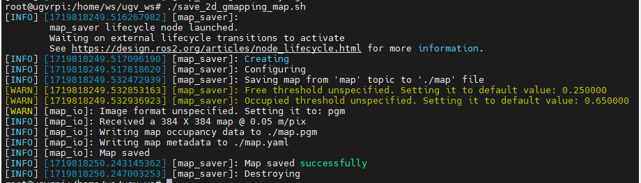
            
            save_2d_gmapping_map.sh内容
            
            ```jsx
            cd /home/ws/ugv_ws/src/ugv_main/ugv_nav/maps
            ros2 run nav2_map_server map_saver_cli -f ./map
            ```
            
        - cartographer
            
            ```jsx
            ros2 launch ugv_slam cartographer.launch.py use_rviz:=true
            ```
            
            [](https://youtu.be/dHyNeuJ0k3U "")
            
            控制小车
            
            ```jsx
            ros2 run ugv_tools keyboard_ctrl
            ```
            
            保存地图
            
            ```jsx
            ./save_2d_cartographer_map.sh
            ```
            
            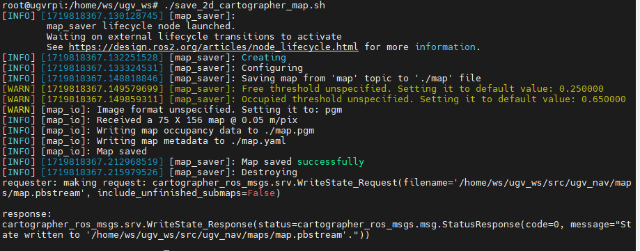
            
            save_2d_cartographer_map.sh内容
            
            ```jsx
            cd /home/ws/ugv_ws/src/ugv_main/ugv_nav/maps
            ros2 run nav2_map_server map_saver_cli -f ./map && ros2 service call /write_state cartographer_ros_msgs/srv/WriteState "{filename: '/home/ws/ugv_ws/src/ugv_main/ugv_nav/maps/map.pbstream'}"
            ```
            
    - 3维（激光雷达+深度相机）
        - rtabmap
            - rtabmap_viz 可视化
                
                ```jsx
                ros2 launch ugv_slam rtabmap_rgbd.launch.py use_rviz:=false
                ```
                
                [](https://youtu.be/J3_QCGVF7Jc "")
                
                控制小车
                
                ```jsx
                ros2 run ugv_tools keyboard_ctrl
                ```
                
            - rviz 可视化
                
                ```jsx
                ros2 launch ugv_slam rtabmap_rgbd.launch.py use_rviz:=true
                ```
                
                [](https://youtu.be/dxey_90tdFI "")
                
                控制小车
                
                ```jsx
                ros2 run ugv_tools keyboard_ctrl
                ```
                
            
            建图完毕后，直接 ctrl+c 退出建图节点，系统将会⾃动保存地图。地图默认保存路径 ~/.ros/rtabmap.db 
            
- 导航
    - 2维
        - 局部定位
            
            use_**localization** amcl（默认），emcl，cartographer
            
            - amcl
                
                先启动，需要手动指定大致初始位置
                
                ```jsx
                ros2 launch ugv_nav nav.launch.py use_**localization**:=amcl use_rviz:=true
                ```
                
                再通过控制小车，简单移动旋转，协助初始定位
                
                ```jsx
                ros2 run ugv_tools keyboard_ctrl
                ```
                
            - emcl
                
                启动后 ，需要手动指定大致初始位置
                
                ```jsx
                ros2 launch ugv_nav nav.launch.py use_localization:=emcl use_rviz:=true
                ```
                
            - cartographer
                
                注意，需使用cartographer建图后，才可以进行
                
                ```jsx
                ros2 launch ugv_nav nav.launch.py use_**localization**:=cartographer use_rviz:=true
                ```
                
                
                
                启动后，如果还未定位到准确位置，可以通过控制小车，简单移动，协助初始定位
                
                ```jsx
                ros2 run ugv_tools keyboard_ctrl
                ```
                
        - 局部导航
            
            use_localplan dwa，teb（默认）
            
            - dwa
                
                ```jsx
                 ros2 launch ugv_nav nav.launch.py use_localplan:=dwa use_rviz:=true
                ```
                
            - teb
                
                ```jsx
                 ros2 launch ugv_nav nav.launch.py use_localplan:=teb use_rviz:=true
                ```
                
    - 3维
        - rtabmap
            - 局部导航
                
                开启定位
                
                ```jsx
                ros2 launch ugv_nav rtabmap_localization_launch.py
                ```
                
                开启nav（可以慢慢等，三维数据加载完毕再导航，要一会时间）
                
                use_localplan dwa，teb（默认）
                
                - dwa
                    
                    ```jsx
                     ros2 launch ugv_nav nav_rtabmap.launch.py use_localplan:=dwa use_rviz:=true
                    ```
                    
                - teb
                    
                    ```jsx
                     ros2 launch ugv_nav nav_rtabmap.launch.py use_localplan:=teb use_rviz:=true
                    ```
                    
- 建图导航同时开（二维）
    
    ```jsx
    ros2 launch ugv_nav slam_nav.launch.py use_rviz:=true
    ```
    
    - rviz手动发布导航点进行探索（也可使用键盘、手柄、web端进行遥控探索）
        
        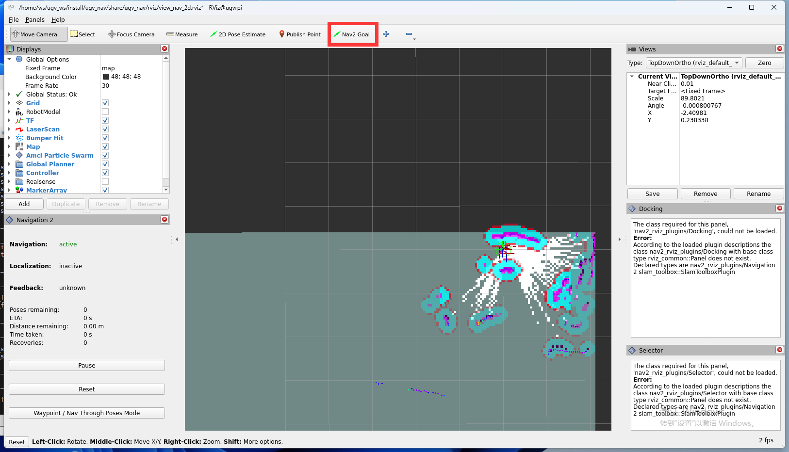
        
    - 自动探索（要在封闭规则区域）
        
        ```jsx
         ros2 launch explore_lite explore.launch.py 
        ```
        
- web ai交互
    - 启动小车
        
        ```jsx
        ros2 launch ugv_bringup bringup_lidar.launch.py use_rviz:=true
        ```
        
    - 启动相关接口
        
        ```jsx
        ros2 run ugv_tools behavior_ctrl
        ```
        
    - web ai 交互（需要有相关的ai接口，目前是ollama本地部署）
        
        ```jsx
        ros2 run ugv_chat_ai app
        ```
        
- web端控制
    
    先驱动小车 参考上述底盘驱动 建图 导航 建图导航同时开
    
    - ugv web端
        
        ```jsx
        ros2 launch ugv_web_app bringup.launch.py host:=ip
        ```
        
- 指令交互
    
    ```jsx
    ros2 run ugv_tools behavior_ctrl
    ```
    
    - 基础控制（需要把车子放下去跑，根据里程计判断是否完成目标）
        
        ```jsx
        ros2 launch ugv_bringup bringup_lidar.launch.py use_rviz:=true
        ```
        
        前进 data 单位 米 
        
        ```jsx
        ros2 action send_goal /behavior ugv_interface/action/Behavior "{command: '[{\"T\": 1, \"type\": \"drive_on_heading\", \"data\": 0.1}]'}"
        ```
        
        后退 data 单位 米  
        
        ```jsx
        ros2 action send_goal /behavior ugv_interface/action/Behavior "{command: '[{\"T\": 1, \"type\": \"back_up\", \"data\": 0.1}]'}"
        ```
        
        旋转 data 单位 度 正数左转 负数右转
        
        ```jsx
        ros2 action send_goal /behavior ugv_interface/action/Behavior "{command: '[{\"T\": 1, \"type\": \"spin\", \"data\": -1}]'}"
        ```
        
        停止
        
        ```jsx
        ros2 action send_goal /behavior ugv_interface/action/Behavior "{command: '[{\"T\": 1, \"type\": \"stop\", \"data\": 0}]'}"
        ```
        
    
    以下需要开启导航
    
    ```jsx
    ros2 launch ugv_nav nav.launch.py use_rviz:=true
    ```
    
    - 获取当前点位置
        
        ```elm
        ros2 topic echo /robot_pose --once
        ```
        
    - 保存为导航点
        
        data 导航点名称，可选a-g
        
        ```jsx
        ros2 action send_goal /behavior ugv_interface/action/Behavior "{command: '[{\"T\": 1, \"type\": \"save_map_point\", \"data\": \"a\"}]'}"
        ```
        
    - 运动到导航点
        
        data 导航点名称，可选a-g
        
        ```jsx
        ros2 action send_goal /behavior ugv_interface/action/Behavior "{command: '[{\"T\": 1, \"type\": \"pub_nav_point\", \"data\": \"a\"}]'}"
        ```
        
    
    保存的点同时也会存在文件里
    
    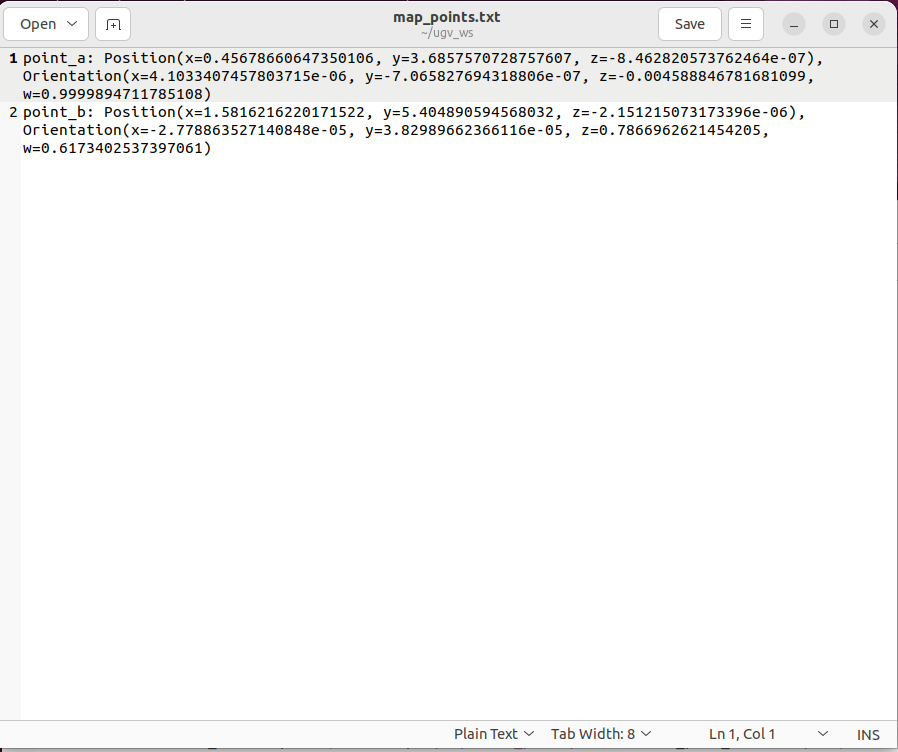
    
- gazebo综合仿真（虚拟机上执行）
    
    ```jsx
    cd ~/.gazebo/
    git clone https://github.com/osrf/gazebo_models.git models
    cp -r /home/ws/ugv_ws/src/ugv_main/ugv_gazebo/models/world models
    cp /home/ws/ugv_ws/ugv_description.zip models 
    cd ~/.gazebo/models/
    unzip ugv_description.zip
    rm -rf ugv_description.zip
    ```
    
    - 查看模型
        - rasp_rover
            
            ```jsx
            export UGV_MODEL=rasp_rover
            ```
            
            启动
            
            ```jsx
             ros2 launch ugv_gazebo display.launch.py 
            ```
            
        - ugv_rover
            
            ```jsx
            export UGV_MODEL=ugv_rover
            ```
            
            启动
            
            ```jsx
             ros2 launch ugv_gazebo display.launch.py 
            ```
            
        - ugv_beast
            
            ```jsx
            export UGV_MODEL=ugv_beast
            ```
            
            启动
            
            ```jsx
             ros2 launch ugv_gazebo display.launch.py 
            ```
            
    - 加载模型
        - 空白
            
            ```elm
            ros2 launch ugv_gazebo bringup_test.launch.py
            ```
            
            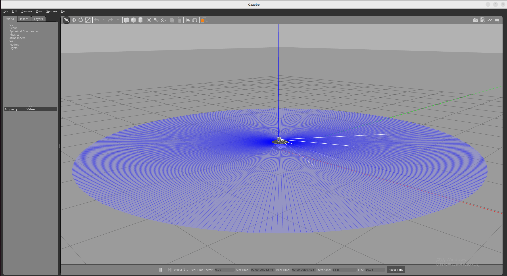
            
        - 房子
            
            ```jsx
            ros2 launch ugv_gazebo bringup.launch.py
            ```
            
            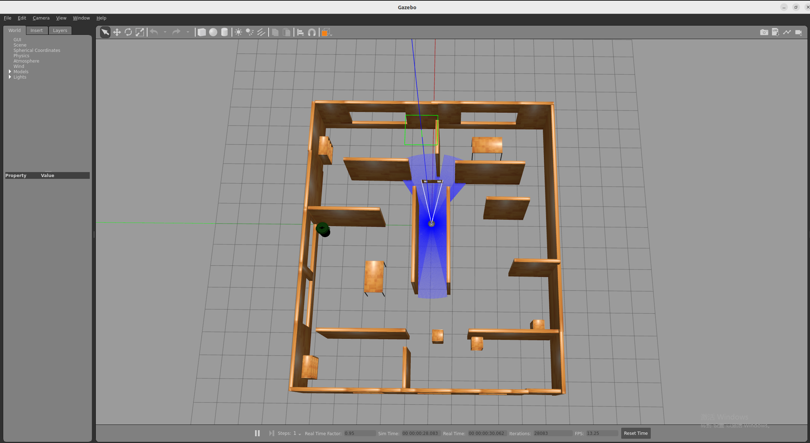
            
    
    以下 以ugv_rover 为例
    
    指定模型
    
    ```jsx
    export UGV_MODEL=ugv_rover
    ```
    
    启动
    
    ```jsx
    ros2 launch ugv_gazebo bringup.launch.py
    ```
    
    - 手柄、键盘控制
        - 手柄控制（手柄usb接口需接在虚拟机）
            
            ```jsx
            ros2 launch ugv_tools teleop_twist_joy.launch.py
            ```
            
        - 键盘控制
            
            ```jsx
            ros2 run ugv_tools keyboard_ctrl
            ```
            
            
            
    - 建图
        - 2维（激光雷达）
            
            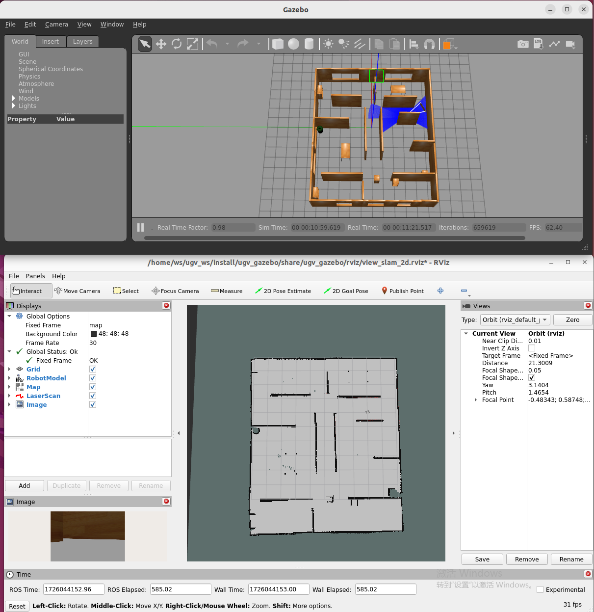
            
            - gmapping
                
                ```elm
                ros2 launch ugv_gazebo gmapping.launch.py
                ```
                
                控制小车
                
                ```jsx
                ros2 run ugv_tools keyboard_ctrl
                ```
                
                保存地图
                
                ```jsx
                ./save_2d_gmapping_map_gazebo.sh
                ```
                
                save_2d_gmapping_map_gazebo.sh内容
                
                ```jsx
                cd /home/ws/ugv_ws/src/ugv_main/ugv_gazebo/maps
                ros2 run nav2_map_server map_saver_cli -f ./map
                ```
                
            - cartographer
                
                ```elm
                ros2 launch ugv_gazebo cartographer.launch.py
                ```
                
                控制小车
                
                ```jsx
                ros2 run ugv_tools keyboard_ctrl
                ```
                
                保存地图
                
                ```jsx
                ./save_2d_cartographer_map_gazebo.sh
                ```
                
                save_2d_cartographer_map_gazebo.sh内容
                
                ```jsx
                cd /home/ws/ugv_ws/src/ugv_main/ugv_gazebo/maps
                ros2 run nav2_map_server map_saver_cli -f ./map && ros2 service call /write_state cartographer_ros_msgs/srv/WriteState "{filename: '/home/ws/ugv_ws/src/ugv_main/ugv_gazebo/maps/map.pbstream'}"
                ```
                
        - 3维（激光雷达+深度相机）
            - rtabmap
                - rtabmap_viz 可视化
                    
                    ```jsx
                    ros2 launch ugv_gazebo rtabmap_rgbd.launch.py
                    ```
                    
                    
                    
                    控制小车
                    
                    ```jsx
                    ros2 run ugv_tools keyboard_ctrl
                    ```
                    
                - rviz 可视化
                    
                    ```jsx
                    ros2 launch ugv_gazebo rtabmap_rgbd.launch.py use_rviz:=true
                    ```
                    
                    控制小车
                    
                    ```jsx
                    ros2 run ugv_tools keyboard_ctrl
                    ```
                    
                
                建图完毕后，直接 ctrl+c 退出建图节点，系统将会⾃动保存地图。地图默认保存路径 ~/.ros/rtabmap.db 
                
    - 导航
        - 2维
            - 局部定位
                
                use_**localization** amcl（默认），emcl，cartographer
                
                - amcl
                    
                    先启动，需要手动指定大致初始位置
                    
                    ```jsx
                    ros2 launch ugv_gazebo nav.launch.py use_**localization**:=amcl 
                    ```
                    
                    再通过控制小车，简单移动旋转，协助初始定位
                    
                    ```jsx
                    ros2 run ugv_tools keyboard_ctrl
                    ```
                    
                - emcl
                    
                    启动后 ，需要手动指定大致初始位置
                    
                    ```jsx
                    ros2 launch ugv_gazebo nav.launch.py use_localization:=emcl 
                    ```
                    
                - cartographer
                    
                    注意，需使用cartographer建图后，才可以进行
                    
                    ```jsx
                    ros2 launch ugv_gazebo nav.launch.py use_**localization**:=cartographer 
                    ```
                    
                    启动后，如果还未定位到准确位置，可以通过控制小车，简单移动，协助初始定位
                    
                    ```jsx
                    ros2 run ugv_tools keyboard_ctrl
                    ```
                    
            - 局部导航
                
                use_localplan dwa，teb（默认）
                
                - dwa
                    
                    ```jsx
                     ros2 launch ugv_gazebo nav.launch.py use_localplan:=dwa 
                    ```
                    
                - teb
                    
                    ```jsx
                     ros2 launch ugv_gazebo nav.launch.py use_localplan:=teb 
                    ```
                    
        - 3维
            - rtabmap
                - 局部导航
                    
                    开启定位
                    
                    ```jsx
                    ros2 launch ugv_gazebo rtabmap_localization_launch.py
                    ```
                    
                    开启nav （可以慢慢等，三维数据加载完毕再导航，要一会时间）
                    
                    
                    
                    use_localplan dwa，teb（默认）
                    
                    - dwa
                        
                        ```jsx
                         ros2 launch ugv_gazebo nav_rtabmap.launch.py use_localplan:=dwa 
                        ```
                        
                    - teb
                        
                        ```jsx
                         ros2 launch ugv_ngazebo nav_rtabmap.launch.py use_localplan:=teb
                        ```
                        
    - 建图导航同时开（二维）
        
        ```jsx
        ros2 launch ugv_gazebo slam_nav.launch.py
        ```
        
        - 自动探索（要在封闭规则区域）
            
            ```jsx
             ros2 launch explore_lite explore.launch.py 
            ```
            
    - web ai交互
        - 启动相关接口
            
            ```jsx
            ros2 run ugv_tools behavior_ctrl
            ```
            
        - web ai 交互（需要有相关的ai接口，目前是ollama本地部署）
            
            ```jsx
            ros2 run ugv_chat_ai app
            ```
            
    - web端控制
        - ugv web端
            
            ```jsx
            ros2 launch ugv_web_app bringup.launch.py host:=ip
            ```
            
    - 指令交互
        
        ```jsx
        ros2 run ugv_tools behavior_ctrl
        ```
        
        - 基础控制（需要把车子放下去跑，根据里程计判断是否完成目标）
            
            前进 data 单位 米 
            
            ```jsx
            ros2 action send_goal /behavior ugv_interface/action/Behavior "{command: '[{\"T\": 1, \"type\": \"drive_on_heading\", \"data\": 0.5}]'}”
            ```
            
            后退 data 单位 米  
            
            ```jsx
            ros2 action send_goal /behavior ugv_interface/action/Behavior "{command: '[{\"T\": 1, \"type\": \"back_up\", \"data\": 0.5}]'}”
            ```
            
            旋转 data 单位 度 正数右转 负数左转
            
            ```jsx
            ros2 action send_goal /behavior ugv_interface/action/Behavior "{command: '[{\"T\": 1, \"type\": \"spin\", \"data\": -1}]'}”
            ```
            
            停止
            
            ```jsx
            ros2 action send_goal /behavior ugv_interface/action/Behavior "{command: '[{\"T\": 1, \"type\": \"spin\", \"data\": 0}]'}”
            ```
            
        
        以下需要开启导航
        
        ```jsx
        ros2 launch ugv_gazebo nav.launch.py use_rviz:=true
        ```
        
        - 获取当前点位置
            
            ```elm
            ros2 topic echo /robot_pose --once
            ```
            
        - 保存为导航点
            
            data 导航点名称，可选a-g
            
            ```jsx
            ros2 action send_goal /behavior ugv_interface/action/Behavior "{command: '[{\"T\": 1, \"type\": \"save_map_point\", \"data\": \"a\"}]'}"
            ```
            
        - 运动到导航点
            
            data 导航点名称，可选a-g
            
            ```jsx
            ros2 action send_goal /behavior ugv_interface/action/Behavior "{command: '[{\"T\": 1, \"type\": \"pub_nav_point\", \"data\": \"a\"}]'}"
            ```
            
        
        保存的点同时也会存在文件里
        
        