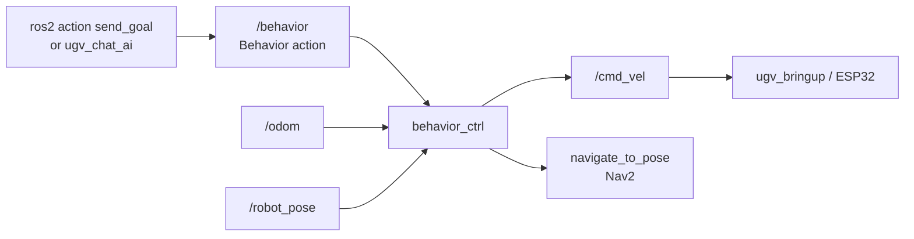

# Behavior Command Control

Send scripted motion and navigation commands to the robot through the ros2 action **`/behavior`** (`ugv_msgs/action/Behavior`), served by **`behavior_ctrl`** in **`ugv_tools`**.

Use this page for **CLI / JSON command control**. For the browser LLM UI that talks to the same action, see [Experimental — Web AI](experimental.md#web-ai).

---

## Prerequisites

1. **Build and source** **`ugv_ws`** ([Installation](installation.md)).
2. Set **`UGV_MODEL`** and **`LDLIDAR_MODEL`** ([environment variables](index.md#product-names-vs-environment-variables)).
3. Start a stack that publishes **`/odom`** — usually [bringup](bringup.md):

```bash
ros2 launch ugv_bringup bringup_lidar.launch.py use_rviz:=true
```

| Command type | Also needs |
|--------------|------------|
| `drive_on_heading`, `back_up`, `spin`, `stop` | **`/odom`** (from bringup / EKF) |
| `save_map_point` | **`/robot_pose`** (map → base TF; from SLAM or Nav2 + `robot_pose_publisher`) |
| `pub_nav_point` | Nav2 **`navigate_to_pose`** action server ([Navigation](navigation.md)) |

!!! warning "One `/cmd_vel` source"
    `behavior_ctrl` publishes **`/cmd_vel`**. Stop keyboard / gamepad, LiDAR demos, vision tracking, Web Teleop, and other motion nodes first — see [Teleoperation — One motion source at a time](teleoperation.md#one-motion-source-at-a-time).

!!! warning "Safety"
    Open-loop moves start as soon as a goal is accepted. Clear the area around the robot.

  Emergency stop:

  ```bash
  ros2 topic pub /cmd_vel geometry_msgs/msg/Twist --once
  ```

  Or send a behavior **`stop`** goal (see [Command JSON](#command-json)).

---

## Start the server

| Role | What to run |
|------|-------------|
| **T0** | Bringup (or SLAM / Nav that already includes it) |
| **T1** | `ros2 run ugv_tools behavior_ctrl` |

```bash
source /opt/ros/humble/setup.bash
source ~/ugv_ws/install/setup.bash   # or /home/ws/ugv_ws/install/setup.bash in the factory container

ros2 run ugv_tools behavior_ctrl
```

Check the action:

```bash
ros2 action list | grep behavior
ros2 action info /behavior
ros2 interface show ugv_msgs/action/Behavior
```

### Data transfer process



---

## Action interface

| | Type | Fields |
|---|------|--------|
| **Goal** | `string command` | JSON **list** of command objects (see below) |
| **Result** | `bool result`, `string message` | `result=true` on success; `message` explains success or failure |
| **Feedback** | `bool feedback`, `string status`, `float32 progress` | Live status text and progress **0.0–1.0** |

Goals are **queued and run in order** (serial execution). A goal that is only **`stop`** preempts the current batch and clears the queue.

Use **`--feedback`** to print progress while a goal runs.

---

## Command JSON

Goal `command` is a JSON **array**. Each item:

```json
{"type": "<command_name>", "data": <value>}
```

| `type` | `data` | Effect |
|--------|--------|--------|
| `drive_on_heading` | meters (`float`) | Drive forward (negative → reverse) along current heading |
| `back_up` | meters (`float`) | Drive backward by \|distance\| |
| `spin` | degrees (`float`) | Rotate in place (positive = left / CCW) |
| `stop` | `0` (ignored) | Publish zero **`/cmd_vel`**; sole-`stop` goals also cancel Nav2 / queued work |
| `save_map_point` | point name (`string`) | Save current **`/robot_pose`** to `map_points.json` |
| `pub_nav_point` | point name (`string`) | Navigate to a saved point via Nav2 **`navigate_to_pose`** (waits until done) |

**Point names:** use `"point_a"` … or short aliases `"a"` … `"g"` (mapped to `point_a` … `point_g`).

Default speeds (open-loop): linear **0.2 m/s**, angular **0.3 rad/s**.

Map points file: **`<ugv_ws>/map_points.json`** (workspace root; legacy `map_points.txt` is migrated once on startup).

---

## Examples

Source the workspace in every terminal. Keep **`behavior_ctrl`** running in **T1**.

### Open-loop motion (needs `/odom`)

Forward 0.5 m:

```bash
ros2 action send_goal /behavior ugv_msgs/action/Behavior \
  "{command: '[{\"type\": \"drive_on_heading\", \"data\": 0.5}]'}" --feedback
```

Back up 0.3 m:

```bash
ros2 action send_goal /behavior ugv_msgs/action/Behavior \
  "{command: '[{\"type\": \"back_up\", \"data\": 0.3}]'}" --feedback
```

Turn left 30° / right 45°:

```bash
ros2 action send_goal /behavior ugv_msgs/action/Behavior \
  "{command: '[{\"type\": \"spin\", \"data\": 30}]'}" --feedback

ros2 action send_goal /behavior ugv_msgs/action/Behavior \
  "{command: '[{\"type\": \"spin\", \"data\": -45}]'}" --feedback
```

Stop (preempt):

```bash
ros2 action send_goal /behavior ugv_msgs/action/Behavior \
  "{command: '[{\"type\": \"stop\", \"data\": 0}]'}" --feedback
```

Sequence (runs in order):

```bash
ros2 action send_goal /behavior ugv_msgs/action/Behavior \
  "{command: '[{\"type\": \"drive_on_heading\", \"data\": 0.3}, {\"type\": \"spin\", \"data\": 90}, {\"type\": \"back_up\", \"data\": 0.2}]'}" --feedback
```

Watch velocity:

```bash
ros2 topic echo /cmd_vel
```

### Map points (needs `/robot_pose`)

Typical **T0**: SLAM or Nav2 launch that already includes bringup and `robot_pose_publisher` — see [Mapping](mapping.md), [Navigation](navigation.md).

Save current pose as `point_a` (alias `a`):

```bash
ros2 action send_goal /behavior ugv_msgs/action/Behavior \
  "{command: '[{\"type\": \"save_map_point\", \"data\": \"a\"}]'}" --feedback
```

Or full name:

```bash
ros2 action send_goal /behavior ugv_msgs/action/Behavior \
  "{command: '[{\"type\": \"save_map_point\", \"data\": \"point_b\"}]'}" --feedback
```

Inspect the file:

```bash
cat "$(ros2 pkg prefix ugv_tools)/../../map_points.json"
```

### Navigate to a saved point (needs Nav2)

**T0** must run Nav2 so **`/navigate_to_pose`** is available, for example:

```bash
ros2 launch ugv_nav nav.launch.py use_rviz:=true
```

Then:

```bash
ros2 action send_goal /behavior ugv_msgs/action/Behavior \
  "{command: '[{\"type\": \"pub_nav_point\", \"data\": \"a\"}]'}" --feedback
```

`pub_nav_point` waits for Nav2 to finish (success / abort / cancel). Feedback shows remaining distance when Nav2 provides it.

### Invalid goals (expect `result: false`)

```bash
ros2 action send_goal /behavior ugv_msgs/action/Behavior \
  "{command: 'not-json'}" --feedback

ros2 action send_goal /behavior ugv_msgs/action/Behavior \
  "{command: '[{\"type\": \"fly\", \"data\": 1}]'}" --feedback
```

---

## Tips

| Topic | Detail |
|-------|--------|
| Progress vs distance | Feedback **`progress: 1.0`** means **100% complete**, not “1 meter”. Distance is in **`status`** (e.g. `drive_on_heading:0.46/0.50m`). |
| Queuing | Multiple `send_goal` calls are accepted and executed **one after another**. |
| `stop` | A goal that contains only `stop` cancels the active command and drains the queue. |
| `pub_nav_point` vs RViz | Uses Nav2 action **`navigate_to_pose`** only (does not also publish `/goal_pose`, to avoid double goals). |
| Web AI | Same action; LLM JSON is produced by **`ugv_chat_ai`**. See [Experimental — Web AI](experimental.md#web-ai). |

---

## Troubleshooting

| Symptom | Likely cause | What to try |
|---------|--------------|-------------|
| No motion | No **`/odom`** or bringup down | `ros2 topic echo /odom` — start [bringup](bringup.md) |
| Goal aborts immediately | Bad JSON / unknown `type` | Check Result **`message`** |
| `save_map_point` fails | No **`/robot_pose`** | Run SLAM or Nav with `robot_pose_publisher` |
| `navigate_to_pose ... not available` | Nav2 not running | [Navigation](navigation.md) on **T0** |
| `navigate_to_pose ... ABORTED` | Planning / localization / unreachable goal | Check Nav2 logs, pose estimate, costmap |
| Robot fights teleop / Nav | Two **`/cmd_vel`** sources | Stop other motion nodes |
| Feedback missing `status` / `progress` | Old **`ugv_msgs`** | `colcon build --packages-select ugv_msgs ugv_tools` and re-`source install/setup.bash` |

---

## Related Tutorials

| Chapter | What it adds |
|---------|----------------|
| [Hardware Driver](bringup.md) | **`/odom`**, **`/cmd_vel`** bridge |
| [Keyboard & Gamepad Control](teleoperation.md) | Manual drive (stop before `behavior_ctrl`) |
| [Mapping](mapping.md) | **`/robot_pose`** while mapping |
| [Navigation](navigation.md) | Nav2 for `pub_nav_point` |
| [Experimental](experimental.md#web-ai) | Browser LLM → same `/behavior` action |
