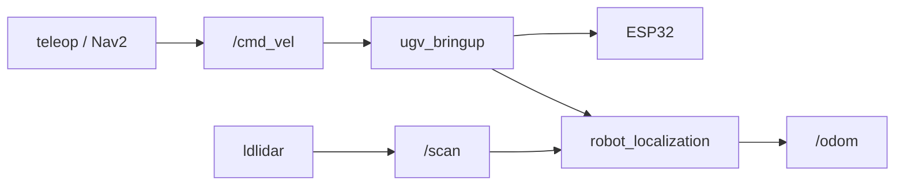

# Hardware Driver

This chapter covers **`ugv_bringup`** on the **physical robot** only: serial to the ESP32, LiDAR, and odometry. **Do not** run **`bringup_gazebo.launch.py`** or Gazebo on the real hardware — simulation is [Gazebo](gazebo.md) on a VM or desktop.

For the robot model, see [Robot Description](description.md).
For ROS2 terms (nodes, topics), see [ROS2 Basics](ros2_basics.md).

## Prerequisites

1. **Build and source** **`ugv_ws`** ([Installation](installation.md)) or SSH into the factory container.
2. Set **`UGV_MODEL`** and **`LDLIDAR_MODEL`** — see [environment variables](index.md#product-names-vs-environment-variables).
3. **Robot powered on**; motor board and LiDAR connected.
4. Clear space around the robot before sending `/cmd_vel`.

---

## Overview

### Before you start

| Run **`bringup_lidar.launch.py` alone when…** | **Do not** |
|-----------------------------------------------|------------|
| Teleop-only ([Teleoperation](teleoperation.md)) | Run **`bringup_gazebo.launch.py`** or Gazebo on the **physical robot** — sim only: [Gazebo](gazebo.md) |
| [Web App](web_app.md) teleop-only **T0** | Open a **second** bringup when [Mapping](mapping.md), [Navigation](navigation.md), or LiDAR / vision **`demo.launch.py`** already **includes** bringup |
| [Experimental](experimental.md) voice tests (no chassis motion) | Run **`bringup_lidar`** and **`bringup_gazebo`** at the same time |

Simulation workflows use **`ugv_gazebo`** — not this chapter. See [Gazebo — Boot simulated robot](gazebo.md#boot-simulated-robot).

### Stack components

`bringup_lidar.launch.py` is the main entry point on the **physical robot**. It starts:

| Component | Package | Role |
|-----------|---------|------|
| Robot model + RViz | `ugv_description` | URDF from `UGV_MODEL`, TF |
| LiDAR driver | `ldlidar` | `/scan` from `LDLIDAR_MODEL` |
| Base driver | `ugv_bringup` | Serial → ESP32, `/cmd_vel`, battery, IMU |
| Wheel odometry | `odom_publisher` | `odom_wheel` from encoders |
| Laser odometry | `rf2o_laser_odometry` | `odom_rf2o` from scan matching |
| EKF fusion | `robot_localization` | Fuses sources → `/odom` |

---

## Hardware connection

| Device | Default port | Baud rate |
|--------|--------------|-----------|
| Motor control board (ESP32) | `/dev/ttyAMA0` | 115200 |
| LiDAR | `/dev/ttyACM0` | 230400 (`ld06`/`ld19`) or 921600 (`stl27l`) |

If devices enumerate differently, edit `serial_port` in `bringup_lidar.launch.py` or the LiDAR `port_name` argument.

---

## Data transfer process



EKF config: `src/ugv_main/ugv_bringup/config/ekf.yaml` — wheel velocities from `odom_wheel`, pose/yaw from `odom_rf2o`.

---

## Key topics

| Topic | Type | Direction | Description |
|-------|------|-----------|-------------|
| `/cmd_vel` | `geometry_msgs/Twist` | Sub | Velocity commands |
| `/scan` | `sensor_msgs/LaserScan` | Pub | 2D LiDAR (`base_lidar_link`) |
| `/odom` | `nav_msgs/Odometry` | Pub | EKF-fused odometry |
| `ugv/voltage` | `sensor_msgs/BatteryState` | Pub | Battery voltage |
| `imu/raw` | `sensor_msgs/Imu` | Pub | IMU from motor board |
| `ugv/led_ctrl` | `std_msgs/Float32MultiArray` | Sub | LED brightness |

---

## Launch {#launch-physical-robot}

**Physical robot only** — on hardware use **`bringup_lidar.launch.py`**, not Gazebo.

```bash
ros2 launch ugv_bringup bringup_lidar.launch.py use_rviz:=true
```

If the program no longer needs to run, please use **`Ctrl+C`** to close the running session.

| Argument | Default | Description |
|----------|---------|-------------|
| `use_rviz` | `false` | Open RViz with `view_bringup.rviz` |

For **simulation**, use [Gazebo](gazebo.md) — **`bringup_gazebo.launch.py`** runs on a VM or desktop, not on the Pi/Jetson driving the real UGV.

### Verify

1. Rotate the robot — laser scan and odometry should update in RViz.
2. Check topics.
3. TF: `odom` → `base_footprint` → `base_link` → `base_lidar_link`

---

## Troubleshooting

| Symptom | Likely cause | What to try |
|---------|--------------|-------------|
| Empty `/scan` | Wrong `LDLIDAR_MODEL` or USB | Check cable, `/dev/ttyACM0` |
| No `/odom` | EKF not started | `use_ekf:=true` (default) |
| Robot does not move | No `/cmd_vel` publisher | Start teleop or send zero twist to test |
| Wrong URDF in RViz | Wrong `UGV_MODEL` | `echo $UGV_MODEL` |

---

## Related Tutorials

| Chapter | What it adds |
|---------|----------------|
| [Keyboard & Gamepad Control](teleoperation.md) | Publish `/cmd_vel` |
| [LiDAR Interaction](lidar.md) | `demo.launch.py` includes bringup |
| [Mapping](mapping.md) | SLAM (includes bringup) |
| [Navigation](navigation.md) | Nav2 (includes bringup) |
| [Vision](vision.md) | `demo.launch.py` includes bringup (USB camera only for non-OAK `exe`) |
| [Gazebo](gazebo.md) | **`bringup_gazebo.launch.py`** — simulation only (VM / desktop), not on the physical robot |

**Next:** [Keyboard & Gamepad Control](teleoperation.md).
