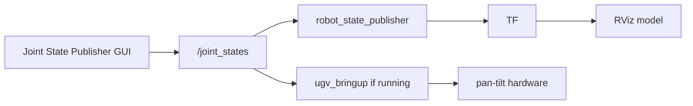

# Robot Description

This chapter introduces the **`ugv_description`** package: where the robot model files live, which environment variables select your chassis, and how to view the model in RViz.

For ROS2 terms (nodes, topics), see [ROS2 Basics](ros2_basics.md).
For dual-controller layout and kit naming, see [UGV Basics](ugv_basics.md).

## Prerequisites

1. **Build and source** **`ugv_ws`** ([Installation](installation.md)) or SSH into the factory container.
2. Set **`UGV_MODEL`** and **`LDLIDAR_MODEL`** to match your hardware — see [Environment variables](#environment-variables) below.

---

## Package file layout

```
ugv_description/
├── urdf/
│   ├── bases/
│   │   ├── ugv_rover.xacro       # 6-wheel 4WD (UGV_MODEL=ugv_rover)
│   │   ├── ugv_beast.xacro       # tracked (UGV_MODEL=ugv_beast)
│   │   ├── rasp_rover.xacro      # 4WD (UGV_MODEL=rasp_rover)
│   │   └── empty.urdf            # optional extras hook
│   ├── wheels/
│   │   ├── rover_wheel.xacro     # ugv_rover / rasp_rover wheels
│   │   └── beast_wheel.xacro     # ugv_beast tracks
│   ├── sensors/
│   │   ├── lidar.xacro           # base_lidar_link → /scan frame
│   │   ├── 3d_camera.xacro       # OAK-D Lite mount (3d_camera_link)
│   │   └── pt.xacro              # pan-tilt gimbal joints
│   ├── gazebo/                   # Gazebo plugins & transmissions (sim)
│   │   ├── ugv_rover.gazebo
│   │   ├── ugv_beast.gazebo
│   │   └── rasp_rover.gazebo
│   └── materials.xacro
├── meshes/
│   ├── bases/                    # chassis STL per model
│   ├── wheels/                   # rover / beast wheel STLs
│   └── sensors/                  # LiDAR, OAK, pan-tilt STLs
├── config/
│   ├── ros2_controllers.yaml     # Pan-tilt ros2_control (hardware bringup + Gazebo)
│   └── initial_positions.yaml
├── launch/
│   └── display.launch.py         # URDF + RViz (use_rviz:=true)
└── rviz/
    └── view_description.rviz
```

| Path | Purpose |
|------|---------|
| `urdf/bases/*.xacro` | Main robot model selected by **`UGV_MODEL`** |
| `urdf/sensors/` | LiDAR, OAK-D, pan-tilt includes shared across chassis |
| `urdf/gazebo/` | Simulation plugins when **`use_gazebo:=true`** ([Gazebo](gazebo.md)) |
| `meshes/` | STL visual/collision geometry |
| `launch/display.launch.py` | `robot_state_publisher` + optional joint GUI or `ros2_control` |
| `config/ros2_controllers.yaml` | Pan-tilt controller config — used whenever **`ros2_control`** starts (see below) |

Main xacro entry (expanded at launch time):

```text
ugv_description/urdf/bases/<UGV_MODEL>.xacro
```

SLAM and Nav2 reuse the same link and frame names from this package.

---

## Environment variables

Set during [Installation](installation.md) (`build_first.sh`) or in `~/.bashrc` (pre-set on factory images):

```bash
echo $UGV_MODEL $LDLIDAR_MODEL
```

| Variable | Values | Effect |
|----------|--------|--------|
| **`UGV_MODEL`** | `ugv_rover`, `ugv_beast`, `rasp_rover` | Loads `urdf/bases/<model>.xacro` — chassis mesh, wheels, sensor mounts |
| **`LDLIDAR_MODEL`** | `ld06`, `ld19`, `stl27l` | **LiDAR driver** baud rate in `ldlidar` — does **not** change URDF; frame is always **`base_lidar_link`** |

| Hardware (WaveShare) | `UGV_MODEL` | Typical `LDLIDAR_MODEL` |
|----------------------|-------------|------------------------|
| [UGV Rover PT ROS2 Kit](https://www.waveshare.com/ugv-rover-pt-jetson-orin-ros2-kit.htm) — 6-wheel 4WD | `ugv_rover` | `ld06` / `ld19` / `stl27l` (match your LiDAR) |
| [UGV Beast PT ROS2 Kit](https://www.waveshare.com/ugv-beast-pt-jetson-orin-ros2-kit.htm) — tracked | `ugv_beast` | `ld06` / `ld19` / `stl27l` (match your LiDAR) |
| [RaspRover PT AI Kit](https://www.waveshare.com/rasprover.htm) — 4WD | `rasp_rover` | Set when LiDAR is added for ROS2 workflows |

See also [index — Product names vs environment variables](index.md#product-names-vs-environment-variables).

**`UGV_MODEL`** selects chassis geometry and which wheel xacro is included (`rover_wheel` vs `beast_wheel`).  
**`ugv_rover`** and **`ugv_beast`** default xacro include OAK-D mount (`3d_camera_link`); **`rasp_rover`** includes LiDAR and pan-tilt only.

If the chassis in RViz does not match your hardware, switch **`UGV_MODEL`** and relaunch.

### LiDAR model (`LDLIDAR_MODEL`)

**Driver only** — `LDLIDAR_MODEL` is read by **`ldlidar`** at runtime ([Hardware Driver](bringup.md)). It does **not** swap LiDAR meshes in URDF.

| `LDLIDAR_MODEL` | Serial baud rate | Typical kit LiDAR |
|-----------------|------------------|-------------------|
| `ld06` | 230400 | LD06 |
| `ld19` | 230400 | LD19 |
| `stl27l` | 921600 | STL-27L |

If `/scan` is empty but RViz shows **`base_lidar_link`**, check USB (`/dev/ttyACM0`) and that **`LDLIDAR_MODEL`** matches the sensor on the robot.

---

## RViz Visualization

### RViz Navigation Controls

| Action | Mouse |
|--------|-------|
| Rotate view | Left-click + drag |
| Zoom | Scroll wheel / right-click + drag |
| Pan | Middle-click + drag |

### Joint State Publisher GUI Controls

| Control | Function |
|---------|----------|
| **Joint sliders** | One row per actuated joint. Value is in **radians**. Moving a slider immediately publishes a new `joint_states` message. |
| **Randomize** | Sets all sliders to random values within each joint’s URDF limits. **Do not use on a real robot** unless the area around the gimbal is clear. |

With default **`rviz_config:=description`**, the pan-tilt joints **`pt_base_link_to_pt_link1`** (pan) and **`pt_link1_to_pt_link2`** (tilt) appear as sliders.

### Launch RViz Visualization

Launch the model with RViz and the joint slider window:

```bash
ros2 launch ugv_description display.launch.py use_rviz:=true
```

If the program no longer needs to run, please use **`Ctrl+C`** to close the running session.

Change **`UGV_MODEL`** and relaunch if the chassis in RViz does not match your hardware.

---

### Starts Nodes

| Component | Role |
|-----------|------|
| `joint_state_publisher_gui` | Joint slider window when **`rviz_config:=description`** (default) |
| `robot_state_publisher` | Publishes TF from URDF + `joint_states` (always started) |
| `rviz2` | 3D visualization when **`use_rviz:=true`** (default is `false`) |
| `ros2_control` + spawners | Pan-tilt controllers when **`rviz_config`** is **not** `description`. That includes **hardware** [bringup](bringup.md) / SLAM / Nav (`rviz_config:=bringup`, `slam_*`, `nav_*`) and **Gazebo** bringup — so the real gimbal (or sim PT) can be driven via **`pt_joint_position_controller`**. Standalone **`display.launch.py`** with default **`rviz_config:=description`** uses the joint GUI instead. |

Sliders publish on **`/joint_states`**. **`robot_state_publisher`** updates TF immediately; with **`use_rviz:=true`**, the RViz model follows the same angles.

If [Hardware Driver](bringup.md) is running, **`ugv_bringup`** also listens to **`/joint_states`** for pan-tilt — slider moves can reach the real gimbal.

!!! warning
    Use the **Joint State Publisher sliders** to move the model — keep clearance around the pan-tilt and camera. If **`ugv_bringup`** is active, gimbal angles from sliders may be sent to the hardware; wheel motors are **not** driven from this GUI.

---

**Data transfer process**



1. Drag a **slider** → the node publishes joint angles on **`/joint_states`** (`sensor_msgs/JointState`).
2. **`robot_state_publisher`** reads URDF + `joint_states` and updates **TF** so the RViz model moves.
3. If **`ugv_bringup`** is running, pan-tilt values may be forwarded to the ESP32 gimbal.

Only **revolute** joints from the URDF get a slider. **Fixed** joints (chassis, LiDAR mount, camera links) do not appear.

Does **not** start LiDAR driver, camera pipelines, or wheel motion — safe before first boot.

---

## URDF with Xacro

UGV models in **`ugv_ws`** are written as **Xacro** (XML macros), not a single flat URDF file.  
Launch files expand xacro at runtime using **`UGV_MODEL`**, then pass the result to `robot_state_publisher`, RViz, SLAM, Nav2, and Gazebo.

Main entry files:

```text
ugv_description/urdf/bases/ugv_rover.xacro    # if UGV_MODEL=ugv_rover
ugv_description/urdf/bases/ugv_beast.xacro    # if UGV_MODEL=ugv_beast
ugv_description/urdf/bases/rasp_rover.xacro  # if UGV_MODEL=rasp_rover
```

Each base xacro **includes** wheel, LiDAR, and (when enabled) pan-tilt and OAK-D macros from `urdf/wheels/` and `urdf/sensors/`.  
Gazebo plugins load from `urdf/gazebo/` when **`use_gazebo:=true`**.

`LDLIDAR_MODEL` selects the **LiDAR driver** baud rate — not a different URDF file. All models use frame **`base_lidar_link`** for `/scan`.

### Link

A **link** is a rigid body segment of the robot.

Example — `base_link` in `ugv_rover.xacro`:

```xml
<link name="base_link">
  <visual>
    <geometry>
      <mesh filename="file://$(find ugv_description)/meshes/bases/ugv_rover_base.stl" scale="1.0 1.0 1.0"/>
    </geometry>
  </visual>
  <collision>...</collision>
  <inertial>...</inertial>
</link>
```

Each link can define:

| Element | Purpose |
|---------|---------|
| `<visual>` | What you see in RViz (usually an STL mesh) |
| `<collision>` | Simplified geometry for planning / simulation |
| `<inertial>` | Mass and inertia (used by Gazebo) |

#### UGV links

Shared across **`ugv_rover`**, **`ugv_beast`**, and **`rasp_rover`** (ROS2 Kit):

| Link | Role |
|------|------|
| `base_footprint` | Ground projection of robot center |
| `base_link` | Main chassis body |
| `base_lidar_link` | 2D LiDAR housing — `/scan` `frame_id` |
| `left_up_wheel_link`, `left_down_wheel_link`, `right_up_wheel_link`, `right_down_wheel_link` | Wheels / track wheels |
| `pt_base_link`, `pt_link1`, `pt_link2`, `pt_camera_link` | Pan-tilt + USB camera mount (when **`add_pt:=true`**, default) |

**`ugv_rover`** and **`ugv_beast`** also include:

| Link | Role |
|------|------|
| `3d_camera_link` | OAK-D Lite mount (and depthai frames when expanded) |

**`rasp_rover`** includes LiDAR and pan-tilt only — no OAK-D link in the default xacro.

Open RViz with **`display.launch.py`** to confirm meshes match your kit.

---

### Joint

A **joint** connects a **parent link** to a **child link** and defines how they move relative to each other.

UGV models use names such as **`left_up_wheel_link_joint`**, **`base_lidar_link_joint`**, and **`pt_base_link_to_pt_link1`**.  
The same names appear in URDF, Gazebo **`ros2_control`**, and (for pan-tilt) **`/joint_states`**.

Example — pan joint in `pt.xacro`:

```xml
<joint name="pt_base_link_to_pt_link1" type="revolute">
  <parent link="pt_base_link" />
  <child link="pt_link1" />
  <axis xyz="0 0 1" />
  <limit lower="-3.14" upper="3.14" effort="1.0" velocity="1.0" />
</joint>
```

| XML field | Meaning |
|-----------|---------|
| `type` | How the joint moves (`revolute`, `fixed`, `continuous`, …) |
| `parent` / `child` | Which links this joint connects |
| `origin` | Pose of the child link in the parent frame |
| `axis` | Rotation axis (revolute / continuous joints) |
| `limit` | Min/max angle in **radians** (revolute joints) |

**Fixed** joints have no slider and no entry in `/joint_states`. **Continuous** wheel joints are driven by **`/cmd_vel`** on the real robot (via **`ugv_bringup`**) or by Gazebo in simulation — not by the Joint State Publisher GUI.

#### UGV joints

##### Common (all `UGV_MODEL` values)

| Joint (URDF) | Type | Connects (parent → child) | Real robot |
|--------------|------|---------------------------|------------|
| `base_joint` | fixed | `base_footprint` → `base_link` | — |
| `base_lidar_link_joint` | fixed | `base_link` → `base_lidar_link` | LiDAR mount |
| `left_up_wheel_link_joint` | continuous | `base_link` → `left_up_wheel_link` | Wheel |
| `left_down_wheel_link_joint` | continuous | `base_link` → `left_down_wheel_link` | Wheel |
| `right_up_wheel_link_joint` | continuous | `base_link` → `right_up_wheel_link` | Wheel |
| `right_down_wheel_link_joint` | continuous | `base_link` → `right_down_wheel_link` | Wheel |

##### Pan-tilt (when `add_pt:=true`)

| Joint (URDF) | Type | Connects (parent → child) | Real robot |
|--------------|------|---------------------------|------------|
| `pt_base_link_joint` | fixed | `base_link` → `pt_base_link` | Gimbal base |
| `pt_base_link_to_pt_link1` | revolute | `pt_base_link` → `pt_link1` | Pan |
| `pt_link1_to_pt_link2` | revolute | `pt_link1` → `pt_link2` | Tilt |
| `pt_camera_link_joint` | fixed | `pt_link2` → `pt_camera_link` | USB camera |

These two **revolute** joints appear in the Joint State Publisher GUI and in **`/joint_states`** when **`ugv_bringup`** is running.

##### OAK-D (`ugv_rover`, `ugv_beast`)

| Joint (URDF) | Type | Connects (parent → child) |
|--------------|------|---------------------------|
| `3d_camera_link_joint` | fixed | `base_link` → `3d_camera_link` |

---

## TF Tree

The chains below show the **parent → child** links from URDF (static model).  
After [Hardware Driver](bringup.md) or SLAM / Nav2, **`odom`** → **`base_footprint`** and optionally **`map`** → **`odom`** are added at runtime.

**Click an image for full-screen view** — click outside, press **Esc**, or **×** to close.

---

### ugv_rover


---

### ugv_beast


---

### rasp_rover


---

### With navigation / SLAM (runtime)

```text
map → odom → base_footprint → … (same as above)
```

For frame roles and **`Fixed Frame`** in RViz, see **[UGV Basics — TF frames](ugv_basics.md#tf-frames)**.

---

## Related Tutorials

| Chapter | What it adds |
|---------|----------------|
| [UGV Basics](ugv_basics.md) | Dual-controller layout, kit types, frames |
| [Hardware Driver](bringup.md) | Serial bringup, `/scan`, `/odom` |
| [Keyboard & Gamepad Control](teleoperation.md) | Drive and gimbal |
| [Vision](vision.md) | USB / OAK camera demos |
| [Mapping](mapping.md) | SLAM using `/scan` |
| [Gazebo](gazebo.md) | Simulation with the same URDF |

**Next:** [Hardware Driver](bringup.md).
