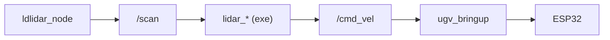

# LiDAR Interaction

Interactive demos in **`ugv_slam`** that use `/scan` to drive the robot — follow, guard, and obstacle avoidance. These are **not** SLAM or Nav2; they publish `/cmd_vel` directly from laser data.

**`demo.launch.py`** starts the full base stack (**`bringup_lidar.launch.py`**) plus **one** demo node — no separate bringup terminal. **Hardware only** — do **not** use Gazebo for these demos.

For 2D mapping, see [Mapping](mapping.md). For camera tracking, see [Vision](vision.md).

## Prerequisites

1. **Build and source** **`ugv_ws`** ([Installation](installation.md)).
2. Set **`UGV_MODEL`** and **`LDLIDAR_MODEL`** ([environment variables](index.md#product-names-vs-environment-variables)).
3. Robot powered on; clear floor area around the robot.

!!! warning "Safety"
    Lift the robot when testing guard/follow logic on a bench. Stop motion when done:

  ```bash
  ros2 topic pub /cmd_vel geometry_msgs/msg/Twist --once
  ```

---

## Overview

### Before you start

| Do | Do not |
|----|--------|
| Pick **one** `exe` on this page | Launch two LiDAR demos at once |
| Use **`demo.launch.py`** (includes bringup) | Run [Mapping](mapping.md) SLAM or [Nav2](navigation.md) at the same time |

These are interactive laser demos — **not** SLAM or Nav2.

### One motion source at a time

These demos publish **`/cmd_vel`** — run **only one** motion publisher at a time. In terminals that are still running, press **`Ctrl+C`** before starting another. See [Teleoperation — One motion source at a time](teleoperation.md#one-motion-source-at-a-time).

### Demo overview

| `exe` | Input | Behavior |
|-------|-------|----------|
| `lidar_follow` | `/scan` | Follow the nearest obstacle, keep ~0.2 m |
| `lidar_guard` | `/scan` | Rotate to face the nearest obstacle (angular only) |
| `lidar_obstacle_avoidance` | `/scan`, `/odom` | Drive forward; turn when blocked (`safe_dist` 0.3 m) |

Source: `src/ugv_main/ugv_slam/ugv_slam/`.

---

## Launch arguments

Each demo below uses the same launch file; only **`exe`** changes.

| Argument | Default | Description |
|----------|---------|-------------|
| **`exe`** | *(required)* | Demo node: `lidar_follow`, `lidar_guard`, or `lidar_obstacle_avoidance` |
| `use_rviz` | `false` | RViz with `view_bringup.rviz` |

### Launch nodes

| Node | Role |
|------|------|
| `ldlidar_node` | LiDAR driver → **`/scan`** |
| `rf2o_laser_odometry` | Laser scan → odometry input for EKF |
| `odom_publisher` | Wheel odometry → EKF (`use_ekf:=true`, default) |
| `ekf_filter_node` | Fuse wheel + laser → **`/odom`** (`use_ekf:=true`, default) |
| `ugv_bringup` | **`/cmd_vel`** → ESP32; IMU, battery |
| `robot_state_publisher` | URDF / TF |
| `lidar_follow` / `lidar_guard` / `lidar_obstacle_avoidance` | **`exe`** demo — **`/scan`** → **`/cmd_vel`** (avoidance also uses **`/odom`**) |
| `rviz2` | RViz (`use_rviz:=true`) |

**Data transfer process**



Same stack as [Mapping](mapping.md) SLAM launches. Details: [Hardware Driver](bringup.md).

If the program no longer needs to run, press **`Ctrl+C`** to close the session.

---

## Verify before driving

After **`demo.launch.py`** is up, confirm sensor data in a **second terminal** (`install/setup.bash` sourced):

```bash
ros2 topic hz /scan
```

All demos need **`/scan`**. You should see a steady rate (typically ~10 Hz).

**Obstacle avoidance** also needs EKF odometry (`use_ekf:=true` by default on bringup):

```bash
ros2 topic hz /odom
```

If the robot only spins or never goes forward during avoidance, check this first.

---

## LiDAR demos

Pick **one** row from [Demo overview](#demo-overview) — same launch file for all three.

### Follow (`lidar_follow`)

Tracks the **closest point** in the full laser scan and tries to hold it at **0.2 m** using PID on angle and distance.

**Launch:**

```bash
ros2 launch ugv_slam demo.launch.py exe:=lidar_follow use_rviz:=true
```

| Item | Value |
|------|-------|
| Subscribes | `/scan` (`sensor_msgs/LaserScan`) |
| Publishes | `/cmd_vel` |
| Target distance | 0.2 m (effective range ~0.1–0.5 m) |
| Control rate | 20 Hz |

Place an object in front of the robot; it should turn toward the nearest return and adjust distance.

### Guard (`lidar_guard`)

Same nearest-point detection as follow, but **only rotates** — `linear.x` stays zero. The robot keeps facing the closest obstacle.

**Launch:**

```bash
ros2 launch ugv_slam demo.launch.py exe:=lidar_guard use_rviz:=true
```

| Item | Value |
|------|-------|
| Subscribes | `/scan` |
| Publishes | `/cmd_vel` (angular only) |

Useful for verifying scan direction and PID tuning in RViz (Fixed Frame: `odom` or `base_link`).

### Obstacle avoidance (`lidar_obstacle_avoidance`)

Drives forward at **0.2 m/s** until something blocks the **60°** front sector. Uses `/odom` to execute 90° or 180° turns, then resumes forward motion.

**Launch:**

```bash
ros2 launch ugv_slam demo.launch.py exe:=lidar_obstacle_avoidance use_rviz:=true
```

| Item | Value |
|------|-------|
| Subscribes | `/scan`, `/odom` |
| Publishes | `/cmd_vel` |
| `safe_dist` | 0.30 m |
| Front sector | ±30° (60° total) |
| Forward speed | 0.20 m/s |

**Requires EKF odometry** from bringup — verify with [`ros2 topic hz /odom`](#verify-before-driving) if the robot only spins or never goes forward.

---

## Troubleshooting

| Symptom | Likely cause | What to try |
|---------|--------------|-------------|
| Launch fails on `exe` | Missing argument | Set `exe:=lidar_follow` (or guard / avoidance) |
| Node runs, robot still | Base stack not up | Prefer `demo.launch.py`; check serial ports |
| No reaction to obstacles | Empty `/scan` | Check LiDAR, `LDLIDAR_MODEL`, `/dev/ttyACM0` |
| Avoid only turns, never forward | No `/odom` | `ros2 topic echo /odom --once` |
| Jerky motion | Object too close/far | Adjust scene; follow targets ~0.2 m |
| Conflicts with teleop / Nav2 / vision | Multiple `/cmd_vel` sources | Stop other motion nodes first — see [One motion source at a time](#one-motion-source-at-a-time) |

---

## Related Tutorials

| Chapter | What it adds |
|---------|----------------|
| [Hardware Driver](bringup.md) | What `demo.launch.py` includes under the hood |
| [Mapping](mapping.md) | SLAM using the same `/scan` |
| [Navigation](navigation.md) | Nav2 (do not run with these demos) |
| [Vision](vision.md) | Camera-based tracking |
| [Keyboard & Gamepad Control](teleoperation.md) | Manual driving (do not run with these demos) |

**Next:** [Vision](vision.md).
