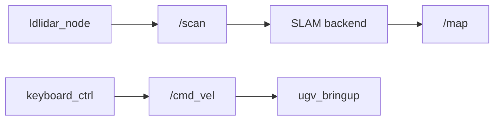

# Mapping

2D/3D SLAM in **`ugv_slam`** — build an occupancy grid (or 3D map) for [Navigation](navigation.md).

**2D** launches include **`bringup_lidar.launch.py`** + **`robot_pose_publisher`** — no separate bringup terminal. **RTAB-Map** includes bringup + OAK-D (hardware) or Gazebo camera (sim) — see [RTAB-Map](#rtab-map).

For Gazebo, use the same launch files with **`use_sim_time:=true`** — see [Gazebo](gazebo.md).

Drive manually while mapping — see [Keyboard & Gamepad Control](teleoperation.md).

For `/scan` and the base stack, see [Hardware Driver](bringup.md).

---

## Prerequisites

1. **Build and source** **`ugv_ws`** ([Installation](installation.md)).
2. Set **`UGV_MODEL`** and **`LDLIDAR_MODEL`** ([environment variables](index.md#product-names-vs-environment-variables)).
3. Robot on the ground with a clear driving path; LiDAR unobstructed.

!!! warning "Safety"
    The robot moves while you teleop during mapping. Clear the area and keep hands away from wheels before driving.

Stop motion when done:

```bash
ros2 topic pub /cmd_vel geometry_msgs/msg/Twist --once
```

---

## Overview

### Before you start

| Do | Do not (stop with **`Ctrl+C`** first) |
|----|--------------------------------------|
| Run **one** SLAM backend from this page | Two SLAM launches at once |
| Drive with **`keyboard_ctrl`** or gamepad in **T1** only | [LiDAR Interaction](lidar.md) demos, [Vision](vision.md) motion tracking, or [Nav2](navigation.md) |
| Save the map **before** stopping SLAM (2D only) | Close SLAM before running **`save_map.sh`** |
| Keep **one** **`/cmd_vel`** source during mapping teleop | Web Teleop, Web AI, or motion demos alongside **T1** — see [One motion source at a time](teleoperation.md#one-motion-source-at-a-time) |

**RTAB-Map** needs an **OAK-D Lite** (RGB-D). Do not run USB-camera vision demos at the same time — see [Vision — USB camera](vision.md#usb-camera).

### What is SLAM?

The robot needs a **map** before autonomous navigation. SLAM builds that map while estimating pose — matching sensor data against the map and correcting drift via loop closure.

2D backends use **`/scan`**. RTAB-Map also uses OAK-D RGB-D.

### SLAM backends

Pick **one** row — launch command under [2D SLAM](#2d-slam) or [RTAB-Map](#rtab-map).

| Backend | Launch file | `save_map.sh` | Notes |
|---------|-------------|---------------|-------|
| SLAM Toolbox | `slam_toolbox.launch.py` | **`3`** | `use_slam:=sync` or `async` |
| Gmapping | `gmapping.launch.py` | **`1`** | 2D grid map |
| Cartographer | `cartographer.launch.py` | **`2`** | also saves **`map.pbstream`** |
| RTAB-Map | `rtabmap.launch.py` | — | 3D; OAK-D on hardware (Gazebo uses sim `/oak/*`); Nav2: `use_localization:=rtabmap` |

Source launches: `src/ugv_main/ugv_slam/launch/`.

---

## Build a map

### Workflow

| Role | What to run |
|----------|-------------|
| **T0** | One launch from [2D SLAM](#2d-slam) or [RTAB-Map](#rtab-map) (`use_rviz:=true` recommended) |
| **T1** | **`ros2 run ugv_tools keyboard_ctrl`** — or gamepad: [Teleoperation](teleoperation.md) |
| **T2** *(2D only, when done)* | **`save_map.sh`** while **T0** is still running |

Optional browser UI while mapping: [Web App](web_app.md) (`ugv_web_app`).

If the program no longer needs to run, press **`Ctrl+C`** in each terminal.

### Verify before driving

After **T0** is up, confirm LiDAR data in **T1** (before teleop):

```bash
ros2 topic hz /scan
```

Wait for a steady rate (typically ~10 Hz).

### Drive and build the map

In RViz (Fixed Frame: **`map`** or **`odom`**) you should see laser points and a growing map.

- Drive **slowly** through every navigable area
- Complete at least one **loop** for loop closure
- If 2D scans look misaligned, slow down; for SLAM Toolbox, try increasing `transform_timeout` in `config/slam_toolbox_online_*.yaml`

### Save the map {#save-the-map}

**2D backends only** — run in **T2** while **T0** is still up (`install/setup.bash` sourced):

```bash
cd /home/ws/ugv_ws && bash save_map.sh
```

Pick the option from the [SLAM backends](#slam-backends) table. Output directory:

```text
src/ugv_main/ugv_nav/maps/
```

[Navigation](navigation.md) loads **`map.yaml`** from here by default.

Then **`Ctrl+C`** on **T0** and **T1**.

RTAB-Map uses its own database / export flow — not **`save_map.sh`**.

---

## Launch arguments

| Argument | Default | Applies to | Description |
|----------|---------|------------|-------------|
| `use_rviz` | `false` | all | RViz — `view_slam_2d.rviz` (2D) or `view_slam_3d.rviz` (RTAB-Map) |
| `use_slam` | `sync` | SLAM Toolbox only | `sync` or `async` — **not** **`nav.launch.py`** `use_slam:=true` ([Navigation — SLAM while navigating](navigation.md#slam-while-navigating)) |
| `use_viz` | `false` | RTAB-Map | Launch `rtabmap_viz` |
| `use_odom` | `none` | RTAB-Map | Hardware: `none` uses bringup **EKF** `/odom`; `icp` / `rgbd` replace EKF with visual/ICP odom. Sim: leave `none` (Gazebo odom). |
| `use_sim_time` | `false` | all | `true` — Gazebo; see [Gazebo](gazebo.md) |

### Launch nodes

| Node | Role |
|------|------|
| `ldlidar_node` | LiDAR → **`/scan`** |
| `rf2o_laser_odometry` | Scan → EKF input |
| `odom_publisher` | Wheel odometry → EKF |
| `ekf_filter_node` | Fused **`/odom`** |
| `ugv_bringup` | Chassis serial bridge |
| `robot_state_publisher` | URDF / TF |
| SLAM backend node | e.g. `sync_slam_toolbox_node`, gmapping, cartographer, `rtabmap` → **`/map`** |
| `robot_pose_publisher` | **`/robot_pose`** — 2D backends only |
| OAK stack / Gazebo camera | RTAB-Map — RGB-D topics |
| `rviz2` | RViz (`use_rviz:=true`) |

Details: [Hardware Driver](bringup.md).

**Data transfer process**



---

## 2D SLAM

Includes **`bringup_lidar.launch.py`** (or **`bringup_gazebo.launch.py`** with **`use_sim_time:=true`**) + SLAM node + **`robot_pose_publisher`**. Pick **one** backend from the [SLAM backends](#slam-backends) table — launch commands below.

### SLAM Toolbox (`slam_toolbox.launch.py`) {#slam-toolbox}

**T0:**

```bash
ros2 launch ugv_slam slam_toolbox.launch.py use_slam:=sync use_rviz:=true
```

Async: **`use_slam:=async`**. **`use_slam` here is sync/async mode only** — for SLAM + Nav2 together use **`nav.launch.py`** `use_slam:=true` ([Navigation](navigation.md#slam-while-navigating)). Config: `src/ugv_main/ugv_slam/config/slam_toolbox_online_*.yaml`.

Save: **`save_map.sh`** option **`3`**.

### Gmapping (`gmapping.launch.py`) {#gmapping}

**T0:**

```bash
ros2 launch ugv_slam gmapping.launch.py use_rviz:=true
```

Save: **`save_map.sh`** option **`1`**.

### Cartographer (`cartographer.launch.py`) {#cartographer}

**T0:**

```bash
ros2 launch ugv_slam cartographer.launch.py use_rviz:=true
```

Save: **`save_map.sh`** option **`2`**.

---

## RTAB-Map {#rtab-map}

3D SLAM via **`rtabmap.launch.py`**. **OAK-D Lite** on hardware; in Gazebo (**Harmonic**) uses **`ros_gz_bridge`** topics **`/oak/*`** — see [Gazebo](gazebo.md). Classic Gazebo publishes OAK via the camera plugin (not the bridge). No **`save_map.sh`**.

**T0** (OAK-D Lite connected):

```bash
ros2 launch ugv_slam rtabmap.launch.py use_rviz:=true
```

On **hardware**, bringup starts **EKF** by default so **`/odom`** and `odom→base_footprint` are available (`use_odom:=none`). Optional visual/ICP odometry: **`use_odom:=icp`** or **`rgbd`** (then EKF is turned off so the two do not fight over TF). Sim uses Gazebo odom — leave **`use_odom:=none`**.

Optional RTAB-Map GUI: **`use_viz:=true`**.

!!! note "RViz vs RTAB-Map Viz"
    Do **not** run **`rtabmap_viz`** (`use_viz:=true`) together with RViz (`use_rviz:=true`) — both 3D views are heavy and often cause stutter on Pi/Jetson. While **driving and building the map**, use **`use_rviz:=true`** only (2D laser + map). 

Nav2 localization: **`use_localization:=rtabmap`** — see [Navigation — RTAB-Map](navigation.md#rtab-map).

---

## Troubleshooting

| Symptom | Likely cause | What to try |
|---------|--------------|-------------|
| TF / scan drop (SLAM Toolbox) | `transform_timeout` too low | +0.1 in `slam_toolbox_online_*.yaml` |
| Empty `/scan` | LiDAR / model mismatch | Check `LDLIDAR_MODEL`, `/dev/ttyACM0` |
| Map drifts | Driving too fast | Slow down; complete a loop |
| No map growth | No teleop / no scans | [`ros2 topic hz /scan`](#verify-before-driving); drive in **T1** |
| `save_map.sh` fails | SLAM already stopped | Save while **T0** still runs |
| RTAB-Map: no camera | OAK / USB conflict | Stop USB vision demos; check OAK cable |
| RTAB-Map: lag / freeze | RViz + `rtabmap_viz` together | Use **`use_rviz:=true`** only while mapping; open **`use_viz:=true`** after driving — see [RTAB-Map](#rtab-map) |

---

## Related Tutorials

| Chapter | What it adds |
|---------|----------------|
| [Navigation](navigation.md) | Use saved **`map.yaml`** with Nav2 |
| [Keyboard & Gamepad Control](teleoperation.md) | Drive while mapping |
| [LiDAR Interaction](lidar.md) | Laser demos (stop before SLAM) |
| [Vision](vision.md) | Camera demos (stop before SLAM) |
| [Gazebo](gazebo.md) | Mapping in simulation |
| [Web App](web_app.md) | Optional browser teleop / map view while mapping |
| [Hardware Driver](bringup.md) | What SLAM launches include |

**Next:** [Navigation](navigation.md).
