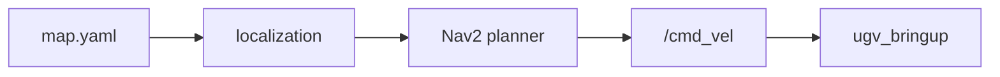

# Navigation

[Nav2](https://navigation.ros.org/) autonomous navigation in **`ugv_nav`** — on a **saved map** (default) or **while mapping** with **`use_slam:=true`**.

**`nav.launch.py`** includes **`bringup_lidar.launch.py`**, Nav2 stack, and **`robot_pose_publisher`** — no separate bringup terminal.

**Default path:** build and save a map first — see [Mapping](mapping.md). **Alternative:** [SLAM while navigating](#slam-while-navigating) (`use_slam:=true` on **`nav.launch.py`**, not the Mapping chapter’s `use_slam:=sync`). For Gazebo, add **`use_sim_time:=true`** — see [Gazebo](gazebo.md).

---

## Prerequisites

1. **Build and source** **`ugv_ws`** ([Installation](installation.md)).
2. Set **`UGV_MODEL`** and **`LDLIDAR_MODEL`** ([environment variables](index.md#product-names-vs-environment-variables)).
3. A saved map in **`src/ugv_main/ugv_nav/maps/`** — see [Save the map](mapping.md#save-the-map). **Not required** for [SLAM while navigating](#slam-while-navigating) (`use_slam:=true`).

Default map file: **`src/ugv_main/ugv_nav/maps/map.yaml`**.

!!! warning "Safety"
    Nav2 moves the chassis autonomously once you send a goal. Clear the area and keep hands away from wheels before launching.

Emergency stop:

```bash
ros2 topic pub /cmd_vel geometry_msgs/msg/Twist --once
```

---

## Overview

### Before you start

| Do | Do not (stop with **`Ctrl+C`** first) |
|----|--------------------------------------|
| Run **`nav.launch.py`** only | [LiDAR Interaction](lidar.md), [Vision](vision.md) motion tracking, or keyboard/gamepad teleop **at the same time** |
| **Saved-map path:** use a map that matches the room | Navigate without **2D Pose Estimate** when AMCL has not converged |
| **`use_slam:=true` path:** clear space; optional **`explore_lite`** in **T1** | Run teleop, LiDAR/vision demos, or Web Teleop alongside **`explore_lite`** |
| Pick **one** localization + **one** local planner per session | Two Nav2 launches at once |
| Stop other **`/cmd_vel`** sources before Nav2 | Teleop, LiDAR/vision demos, Web Teleop, Web AI — see [One motion source at a time](teleoperation.md#one-motion-source-at-a-time) |

**RTAB-Map** localization needs **OAK-D Lite** on hardware (Gazebo uses sim **`/oak/*`** — [Gazebo](gazebo.md)). Do not run USB-camera vision demos together on hardware; see [Vision — USB camera](vision.md#usb-camera).

### What is Nav2?

**Saved-map mode (default):** Nav2 loads a **static map**, estimates pose (**localization**), plans a path (**global planner**), and outputs **`/cmd_vel`** (**local planner** + controllers) to drive the robot to RViz goals.

**SLAM while navigating** (`use_slam:=true`): online SLAM Toolbox builds **`/map`** while Nav2 plans — see [SLAM while navigating](#slam-while-navigating).

This workspace wraps Nav2 in **`nav.launch.py`** with bringup and tuned params under **`ugv_nav/params/`**.

### Recommended combinations {#recommended-combinations}

Start with these **T0** examples — pick **one** row for your goal:

| Goal | **T0** example |
|------|----------------|
| **First successful navigation** *(recommended)* | `ros2 launch ugv_nav nav.launch.py use_rviz:=true` → **AMCL** + **DWA** (defaults) |
| **Cartographer map / localization** | `… use_localization:=cartographer` → keep **DWA** (default) |
| **Stronger obstacle avoidance** *(enough CPU)* | `… use_localization:=amcl use_localplan:=mppi` (or `teb` / `rpp`) |
| **Gazebo** | Add **`use_sim_time:=true`**; prefer **`use_rviz:=false`** if the VM is slow |

!!! tip "Cartographer + TEB / RPP / MPPI"
    With **`use_localization:=cartographer`**, use **`use_localplan:=dwa`** (default). TEB / RPP / MPPI use hard collision checks and often fail when Cartographer pose and the static **`map.yaml`** are slightly inconsistent. Prefer **AMCL** (or EMCL) if you want TEB / MPPI / RPP.

---

## Run navigation

### Workflow (saved map only) {#workflow-saved-map-only}

Pick **one** option under [Localization](#localization) and **one** under [Local planners](#local-planners). Merge into a single **T0** launch line (`use_localization` + `use_localplan` if not using the [defaults](#recommended-combinations)).

**Do not use this block for map-while-navigating** — see [SLAM while navigating](#slam-while-navigating) (`use_slam:=true`) instead.

| Step | Action |
|------|--------|
| **1** | **T0** — [Localization](#localization) + [Local planners](#local-planners) |
| **2** | [Verify](#verify-before-navigating) **`/scan`** |
| **3** | RViz → **2D Pose Estimate** — align laser with the **saved** map *(AMCL / EMCL / slam_toolbox; Cartographer: drive slowly if pose is not locked yet)* |
| **4** | RViz → **2D Goal Pose** — send navigation goal |

If the program no longer needs to run, press **`Ctrl+C`**.

Prefer **2D Pose Estimate** for initial alignment. If AMCL is slow to converge, a short manual nudge with teleop in **T1** can help — but **stop teleop before sending goals** ([Teleoperation](teleoperation.md) also publishes **`/cmd_vel`**).

### Verify before navigating

After **T0** is up, confirm LiDAR data (`install/setup.bash` sourced):

```bash
ros2 topic hz /scan
```

Check pose after **2D Pose Estimate** *(saved-map path only)*:

```bash
ros2 topic echo /robot_pose --once
```

In RViz, the laser scan should line up with walls in the map (Fixed Frame: **`map`**).

### Set initial pose and goals *(saved map)*

1. **2D Pose Estimate** — click on the map where the robot is; drag to set heading.
2. Wait until the scan overlay matches the map.
3. **2D Goal Pose** — click goal position and heading.

Nav2 publishes **`/cmd_vel`** until the goal succeeds or is cancelled.

---

## SLAM Toolbox: which path? {#slam-toolbox-paths}

Both use SLAM Toolbox, but **different launch arguments and prerequisites**:

| Goal | When | **T0** launch | Prerequisites |
|------|------|---------------|---------------|
| **Navigate on a saved map** | You already ran [Mapping — SLAM Toolbox](mapping.md#slam-toolbox) and **`save_map.sh`** | `nav.launch.py` + **`use_localization:=slam_toolbox`** | **`map.yaml`** + **`map.posegraph`** in `ugv_nav/maps/` |
| **Map while navigating** | No saved map yet, or you want to explore and build coverage in one session | `nav.launch.py` + **`use_slam:=true`** | None — online SLAM; see [SLAM while navigating](#slam-while-navigating) |

Do **not** use **`use_localization:=slam_toolbox`** without a saved **`map.posegraph`**. Do **not** use **`use_slam:=true`** when you only want to localize on an existing map — use AMCL or **`use_localization:=slam_toolbox`** instead.

---

## Launch arguments

| Argument | Default | Description |
|----------|---------|-------------|
| `use_rviz` | `false` | RViz — `view_nav_2d.rviz` (or `view_nav_3d.rviz` for RTAB-Map) |
| `use_localization` | `amcl` | See [Localization](#localization) |
| `use_localplan` | `dwa` | See [Local planners](#local-planners) |
| `use_slam` | `false` | `true` — SLAM Toolbox + Nav2 on **`nav.launch.py`** only — not `use_slam:=sync` on [Mapping](mapping.md#slam-toolbox); see [SLAM while navigating](#slam-while-navigating) |
| `use_keepout_zones` | `false` | Enable keepout filter — see [Keepout zones](#keepout-zones) |
| `keepout_mask` | `maps/mask.yaml` | Keepout mask yaml path |
| `use_sim_time` | `false` | `true` — Gazebo; see [Gazebo](gazebo.md) |

### Launch nodes

| Node | Role |
|------|------|
| `ldlidar_node` | LiDAR → **`/scan`** |
| `ugv_bringup` | **`/cmd_vel`** → ESP32 |
| `ekf_filter_node` | **`/odom`** (via bringup) |
| `robot_state_publisher` | URDF / TF |
| Nav2 stack | localization, planning, **`/cmd_vel`** |
| `robot_pose_publisher` | **`/robot_pose`** |
| `oak_d_lite` pipeline | RTAB-Map localization only |
| `rviz2` | RViz (`use_rviz:=true`) |

Details: [Hardware Driver](bringup.md).

**Data path:**



---

## Localization

Argument: **`use_localization`**. Pick **one** option below. Default local planner is [DWA](#dwa); for [TEB](#teb), [RPP](#rpp), or [MPPI](#mppi), add **`use_localplan:=...`** on the same **T0** line — see [Local planners](#local-planners) and [Recommended combinations](#recommended-combinations).

| Value | Map assets | Notes |
|-------|------------|-------|
| **`amcl`** *(default)* | `map.yaml` | Best general choice; pairs with any local planner |
| **`emcl`** | `map.yaml` | AMCL alternative |
| **`cartographer`** | `map.yaml` + **`map.pbstream`** | Prefer **DWA**; see tip above |
| **`slam_toolbox`** | `map.yaml` + **`map.posegraph`** | Saved-map localization only |
| **`rtabmap`** | RTAB-Map / 3D workflow | OAK-D on hardware; Gazebo **`/oak/*`** in sim |

### AMCL

2D laser localization on **`map.yaml`**. Usual start: **AMCL** + **DWA** (both defaults).

**T0:**

```bash
ros2 launch ugv_nav nav.launch.py use_rviz:=true
```

### EMCL

Alternative 2D Monte Carlo localization on **`map.yaml`**.

**T0:**

```bash
ros2 launch ugv_nav nav.launch.py use_rviz:=true use_localization:=emcl
```

### Cartographer

Requires **`map.yaml`** and **`map.pbstream`** from [Cartographer mapping](mapping.md#cartographer) — save them together with **`save_map.sh`** option **`2`**. Keep **DWA** (default).

**T0:**

```bash
ros2 launch ugv_nav nav.launch.py use_rviz:=true use_localization:=cartographer
```

For TEB / MPPI / RPP with a Cartographer-built map, switch localization to **AMCL** (same **`map.yaml`**):

```bash
ros2 launch ugv_nav nav.launch.py use_rviz:=true use_localization:=amcl use_localplan:=teb
```

### SLAM Toolbox

Requires **`map.yaml`** and **`map.posegraph`** from [SLAM Toolbox mapping](mapping.md#slam-toolbox). **Saved-map localization only** — not map-while-navigating; see [SLAM Toolbox: which path?](#slam-toolbox-paths).

**T0:**

```bash
ros2 launch ugv_nav nav.launch.py use_rviz:=true use_localization:=slam_toolbox
```

### RTAB-Map

3D localization — **OAK-D Lite** on hardware; Gazebo uses bridged/plugin **`/oak/*`** ([Gazebo](gazebo.md)). Uses **`view_nav_3d.rviz`**. Map from [RTAB-Map mapping](mapping.md#rtab-map). On hardware, do not run USB-camera vision demos at the same time.

**T0:**

```bash
ros2 launch ugv_nav nav.launch.py use_rviz:=true use_localization:=rtabmap
```

---

## Local planners

Argument: **`use_localplan`**. Param files under **`ugv_nav/params/`**. Pick **one** option. Default **`dwa`** needs no extra argument on the [Localization](#localization) launch. For other planners, add **`use_localplan:=teb|rpp|mppi`** and keep your **`use_localization:=...`** on the same **T0** line.

| Value | Param file | When to use |
|-------|------------|-------------|
| **`dwa`** *(default)* | `params/dwa.yaml` | First run; Cartographer localization; limited CPU |
| **`teb`** | `params/teb.yaml` | Stronger avoidance — prefer with **AMCL** / **EMCL** |
| **`rpp`** | `params/rpp.yaml` | Path tracking — prefer with **AMCL** / **EMCL** |
| **`mppi`** | `params/mppi.yaml` | Predictive avoidance — prefer with **AMCL** / **EMCL** |

### DWA

Dynamic Window Approach — **default**. Use any [Localization](#localization) launch as-is ([AMCL](#amcl) + DWA is the recommended start; also the safe choice for [Cartographer](#cartographer)).

**T0** (defaults — AMCL + DWA):

```bash
ros2 launch ugv_nav nav.launch.py use_rviz:=true
```

### TEB

Timed Elastic Band. Prefer **AMCL** (or EMCL), not Cartographer localization.

**T0:**

```bash
ros2 launch ugv_nav nav.launch.py use_rviz:=true use_localplan:=teb
```

### RPP

Regulated Pure Pursuit. Prefer **AMCL** (or EMCL).

**T0:**

```bash
ros2 launch ugv_nav nav.launch.py use_rviz:=true use_localplan:=rpp
```

### MPPI

Model Predictive Path Integral. Prefer **AMCL** (or EMCL).

**T0:**

```bash
ros2 launch ugv_nav nav.launch.py use_rviz:=true use_localplan:=mppi
```

---

## SLAM while navigating {#slam-while-navigating}

**SLAM while navigating** — run **SLAM Toolbox** and **Nav2** in one session when you do **not** have a saved **`map.yaml`** yet, or when you want to extend coverage while navigating.

!!! note "`use_slam` is not the Mapping launch argument"
    **`slam_toolbox.launch.py`** uses **`use_slam:=sync`** or **`async`** (SLAM Toolbox mode) — see [Mapping — SLAM Toolbox](mapping.md#slam-toolbox).
    Here, **`use_slam:=true`** is only on **`nav.launch.py`** and turns on SLAM + Nav2 together. Different launch files — do not copy `sync`/`async` values onto **`nav.launch.py`**.

**T0** starts online SLAM instead of AMCL on a static map (`use_slam:=true` swaps in `slam_launch.py` instead of `localization_launch.py`):

```bash
ros2 launch ugv_nav nav.launch.py use_rviz:=true use_slam:=true
```

Clear the area — Nav2 and **`explore_lite`** both drive via Nav2 on **T0**. Stop teleop, LiDAR/vision demos, and Web Teleop first.

### Workflow (`use_slam:=true`)

**Do not** follow [Workflow (saved map only)](#workflow-saved-map-only) — no **2D Pose Estimate** on a pre-made map; SLAM builds **`/map`** as the robot moves.

| Step | Action |
|------|--------|
| **1** | **T0** — `nav.launch.py use_slam:=true` (command below) |
| **2** | [Verify](#verify-before-navigating) **`/scan`** |
| **3** | Wait for **`/map`** — `ros2 topic hz /map` (a few seconds after start or short manual drive) |
| **4** | **T1** optional **`explore_lite`**, or RViz **2D Goal Pose** on the **growing** map |
| **5** | **T2** — **`save_map.sh`** option **`3`** when done |

### Autonomous exploration (`explore_lite`) {#autonomous-exploration-explore_lite}

Optional **T1** — **`explore_lite`** sends frontier goals to Nav2’s **`navigate_to_pose`** action on **T0**; it does **not** publish **`/cmd_vel`** itself. Subscribes to live **`/map`** from SLAM (see `explore_lite/config/params.yaml`).

**T1** (`install/setup.bash` sourced):

```bash
ros2 launch explore_lite explore.launch.py
```

In Gazebo, add **`use_sim_time:=true`** on **T0** and **T1** (must match **`nav.launch.py`**).

You can also send **2D Goal Pose** in RViz manually instead of running **`explore_lite`**.

### Save the map

While **T0** is still running, save in **T2** with **`save_map.sh`** option **`3`** (SLAM Toolbox) — see [Mapping — Save the map](mapping.md#save-the-map). Then **`Ctrl+C`** on **T0** and **T1**.

For Gazebo: add **`use_sim_time:=true`** on the **T0** line above.

---

## Keepout zones

Optional forbidden areas on the map — [Nav2 keepout guide](https://docs.nav2.org/tutorials/docs/navigation2_with_keepout_filter.html#prepare-filter-mask).

1. Prepare **`mask.pgm`** and **`mask.yaml`**
2. Place under **`src/ugv_main/ugv_nav/maps/`**
3. Launch:

```bash
ros2 launch ugv_nav nav.launch.py use_keepout_zones:=true use_rviz:=true
```

---

## Troubleshooting

| Symptom | Likely cause | What to try |
|---------|--------------|-------------|
| `Timed out waiting for transform from base_link to map` | No initial pose *(saved-map path)* | **2D Pose Estimate** in RViz — not used for [SLAM while navigating](#slam-while-navigating); wait for **`/map`** instead |
| Robot does not move to goal | Wrong localization / map mismatch | Re-estimate pose; confirm map matches room; laser must overlay walls (Fixed Frame **`map`**) |
| Planner / controller fails (TEB: `trajectory is not feasible`) | Goal in obstacle, or hard local planner with Cartographer | New goal on free space; with Cartographer use **DWA**, or switch to **AMCL** + TEB/MPPI — see [Recommended combinations](#recommended-combinations) |
| Empty `/scan` | LiDAR / bringup | See [Verify before navigating](#verify-before-navigating) |
| Jerky or no motion | Another **`/cmd_vel`** publisher | Stop teleop / LiDAR / vision demos |
| Cartographer / slam_toolbox nav fails | Missing sidecar file | Save **`map.pbstream`** or **`map.posegraph`** when mapping (same session as **`map.yaml`**) |
| Gazebo / RViz very slow | CPU saturated | **`use_rviz:=false`**; close Gazebo GUI if possible; see [Gazebo](gazebo.md) |
| `explore_lite` idle / no goals | **`use_slam:=false`**, Nav2 not ready, or no **`/map`** yet | **`use_slam:=true`** on **T0**; wait for **`/map`**; in Gazebo match **`use_sim_time`** on **T0** and **T1** |
| Map not growing with **`use_slam:=true`** | Wrong workflow | Confirm **`use_slam:=true`**; drive manually or run **`explore_lite`** — see [SLAM while navigating](#slam-while-navigating) |

---

## Related Tutorials

| Chapter | What it adds |
|---------|----------------|
| [Mapping](mapping.md) | Create **`map.yaml`** and backend-specific files |
| [Package Reference](packages.md) | **`explore_lite`** and other third-party packages |
| [Keyboard & Gamepad Control](teleoperation.md) | Manual nudge only — not with active Nav2 goals |
| [LiDAR Interaction](lidar.md) | Stop before Nav2 |
| [Vision](vision.md) | Stop before Nav2 |
| [Gazebo](gazebo.md) | Nav2 in simulation |
| [Experimental](experimental.md) | Optional voice / Web AI |
| [Web App](web_app.md) | Browser teleop, viz, Nav2 goals |

**Next:** [Experimental](experimental.md).
