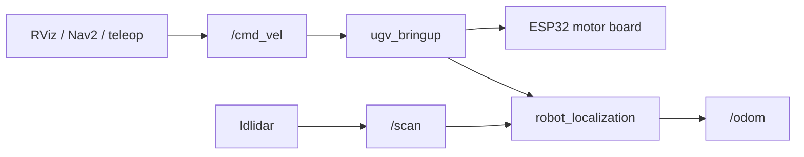

# UGV Basics

UGV-specific concepts used in **`ugv_ws`**: **dual-controller layout**, **kit types**, and **coordinate frames**. This is not generic ROS2 material — see [ROS2 Basics](ros2_basics.md) for nodes, topics, and TF tools.

For URDF and sensor details, see [Robot Description](description.md).

Already built or SSH'd into the factory container? Skip to [Hardware Driver](bringup.md).

---

## Dual-controller layout

WaveShare UGV robots use a **host + slave** architecture:

| Layer | Hardware | Role |
|-------|----------|------|
| **Host** | Raspberry Pi 4B/5 or Jetson Orin Nano | ROS2, SLAM, Nav2, vision, web UI |
| **Slave** | ESP32 on motor board | Motor PID, encoders, IMU, OLED, servo (gimbal), LEDs |

ROS2 nodes on the host talk to the ESP32 over **UART** (`/dev/ttyAMA0` by default). The LiDAR connects separately over USB (`/dev/ttyACM0`).

**Data transfer process**



---

## Kit types (shop naming)

| Shop name | Sensors / software |
|-----------|-------------------|
| **AI Kit** | USB camera, pan-tilt, vision tutorials |
| **ROS2 Kit** | AI Kit + 360° LiDAR + OAK-D Lite + SLAM / Nav2 tutorials |

**`ugv_ws`** targets **ROS2 Kit** workflows. AI Kit owners can add LiDAR and OAK-D per the [WaveShare Wiki](https://www.waveshare.com/wiki/UGV_Rover_PI_ROS2).

Model suffixes on the shop:

| Suffix | Meaning |
|--------|---------|
| **PT** | Pan-tilt gimbal included |
| **PI5 / PI4B** | Raspberry Pi host variant (SSH user `ws`) |
| **Jetson Orin** | NVIDIA Jetson host variant (SSH user `jetson`) |
| **Acce** | Accessories only — you supply the Pi board |
| **ROS2 Kit** | Full autonomous navigation stack |

---

## `UGV_MODEL` vs product

| `UGV_MODEL` | Chassis | Max speed (typical) | Example product |
|-------------|---------|---------------------|-----------------|
| `ugv_rover` | 6-wheel 4WD | ~1.3 m/s | [UGV Rover PT ROS2 Kit](https://www.waveshare.com/ugv-rover-pt-jetson-orin-ros2-kit.htm) |
| `ugv_beast` | Tracked | ~0.35 m/s | [UGV Beast PT ROS2 Kit](https://www.waveshare.com/ugv-beast-pt-jetson-orin-ros2-kit.htm) |
| `rasp_rover` | 4WD | ~0.65 m/s | [RaspRover PT AI Kit](https://www.waveshare.com/rasprover.htm); add LiDAR for ROS2 |

`LDLIDAR_MODEL` (`ld06`, `ld19`, `stl27l`) must match the LiDAR on your kit.

---

## TF frames

```text
map → odom → base_footprint → base_link → base_lidar_link
```

| Frame | Role |
|-------|------|
| `map` | Global map frame (SLAM / Nav2) |
| `odom` | Odometry frame (EKF output) |
| `base_footprint` | Ground projection of robot center |
| `base_link` | Robot body |
| `base_lidar_link` | 2D LiDAR scan frame (`/scan` `frame_id`) |

SLAM and Nav2 add `map` above `odom`. During bringup-only tests, RViz **Fixed Frame** is usually `odom`.

```bash
ros2 run tf2_ros tf2_echo odom base_lidar_link
```

---

## Factory Docker image

Most kits ship a **pre-built Docker container** with `UGV_MODEL`, `LDLIDAR_MODEL`, and ROS2 already configured.

### Host login (port 22)

SSH to the **robot host** first — user depends on the board:

| Host board | Host name | SSH user | Password | Port |
|------------|-----------|----------|----------|------|
| Raspberry Pi 4B / 5 | *(IP or mDNS)* | `ws` | `ws` | **22** |
| Jetson Orin Nano | **`jetson`** | `jetson` | `jetson` | **22** |

### Container login (port 23)

After `ros2.sh` starts the container, SSH again into the ROS environment:

| Field | Value |
|-------|-------|
| User | `root` |
| Password | `ws` |
| Port | **23** |

### Workflow

**Physical robot (Pi / Jetson)** — SSH into the container after starting Docker on the host:

| Step | Action |
|------|--------|
| 1 | SSH to host — Pi: `ws@<robot-ip>` · Jetson: `jetson@<robot-ip>` |
| 2 | From your PC, SSH to host: `cd /home/ws/ugv_ws && bash ros2.sh` |
| 3 | From your PC, SSH to container: `root@<robot-ip>` port **23**, password `ws` |
| 4 | Inside container: `cd /home/ws/ugv_ws && source ~/.bashrc` |

**VM (VirtualBox)** — no SSH; use two local terminals — see [Installation — VM](installation.md#vm-virtualbox-x86).

Container name depends on platform — see [Installation — `ros2.sh` by platform](installation.md#ros2sh-by-platform).

Developers who clone the repo and run `build_first.sh` get the same software without Docker — see [Installation](installation.md).

---

## Related Tutorials

| Chapter | What it adds |
|---------|----------------|
| [Installation](installation.md) | Factory image or source build |
| [Robot Description](description.md) | URDF, cameras, LiDAR |
| [Hardware Driver](bringup.md) | `bringup_lidar.launch.py`, serial ports |
| [Keyboard & Gamepad Control](teleoperation.md) | Drive the robot |
| [ROS2 Basics](ros2_basics.md) | Topics and launch files |

**Next:** [Installation](installation.md) — factory image or `build_first.sh`.
