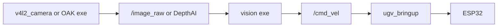

# Vision

USB camera and OAK-D Lite tracking demos in **`ugv_vision`**.

**`demo.launch.py`** includes **`bringup_lidar.launch.py`** on hardware plus **one** vision node — no separate bringup terminal.

- **USB demos** — also starts **`camera.launch.py`** (`v4l2_camera` → **`/image_raw`**).
- **OAK demos** — the node opens the OAK-D camera via **DepthAI** internally; no **`oak_d_lite.launch.py`** needed.

LiDAR follow / guard / avoidance demos live in [LiDAR Interaction](lidar.md).

Voice / Ollama / Web AI are optional — see [Experimental](experimental.md).

---

## Prerequisites

1. **Build and source** **`ugv_ws`** ([Installation](installation.md)).
2. Set **`UGV_MODEL`** and **`LDLIDAR_MODEL`** ([environment variables](index.md#product-names-vs-environment-variables)).
3. USB camera **or** OAK-D Lite connected — **one camera type per session** (see [Before you start](#before-you-start)).

!!! warning "Safety"
    Lift the robot before motion-tracking nodes. Stop with zero **`/cmd_vel`** when done:

  ```bash
  ros2 topic pub /cmd_vel geometry_msgs/msg/Twist --once
  ```

---

## Overview

### Before you start

| Do | Do not |
|----|--------|
| Pick **one** camera pipeline per session (USB **or** OAK) | Run USB and OAK vision demos at the same time |
| Stop the current **`demo.launch.py`** (**`Ctrl+C`**) before switching `exe` or camera type | Mix USB and OAK without stopping the first launch |
| Pick **one** `exe` on this page | Launch two vision demos at once |

Running both camera types can fight for USB bandwidth, block DepthAI (**only one DepthAI app at a time**), or leave **`v4l2_camera`** and an OAK node competing on the same machine.

### One motion source at a time

Demos marked **Motion: Yes** in [USB camera](#usb-camera) or [OAK-D Lite](#oak-d-lite) publish **`/cmd_vel`**. Run **only one** motion publisher at a time — see [Teleoperation — One motion source at a time](teleoperation.md#one-motion-source-at-a-time).

[Pan-tilt tracking](#pan-tilt-tracking) demos publish **`pt_joint_position_controller/commands`**, not **`/cmd_vel`**, but still stop other motion sources before chassis tracking.

---

## Workflow

| Role | What to run |
|----------|-------------|
| **T0** | **`ros2 launch ugv_vision demo.launch.py exe:=<name> use_rviz:=true`** — pick **one** `exe` from [USB camera](#usb-camera), [OAK-D Lite](#oak-d-lite), or [Pan-tilt tracking](#pan-tilt-tracking) |

If the program no longer needs to run, press **`Ctrl+C`**.

---

## Launch arguments

Each demo uses the same launch file; only **`exe`** changes.

| Argument | Default | Description |
|----------|---------|-------------|
| **`exe`** | *(required)* | Vision node executable (see [USB camera](#usb-camera), [OAK-D Lite](#oak-d-lite), [Pan-tilt tracking](#pan-tilt-tracking)) |
| `use_rviz` | `false` | RViz with `view_slam_2d.rviz` (only when `use_bringup:=true`) |
| `use_bringup` | `true` | Include `ugv_bringup` / `ugv_gazebo` bringup. Set **`false`** when another base driver (e.g. **`ugv_roarm_bringup`**) is already running |
| `use_sim_time` | `false` | Gazebo clock; selects `ugv_gazebo` bringup instead of `ugv_bringup` |

### Launch nodes

| Node | Role |
|------|------|
| `ldlidar_node` | LiDAR driver → **`/scan`** |
| `rf2o_laser_odometry` | Laser scan → odometry input for EKF |
| `odom_publisher` | Wheel odometry → EKF (`use_ekf:=true`, default) |
| `ekf_filter_node` | Fuse wheel + laser → **`/odom`** (`use_ekf:=true`, default) |
| `ugv_bringup` | **`/cmd_vel`** → ESP32; IMU, battery |
| `robot_state_publisher` | URDF / TF |
| `v4l2_camera` | USB camera → **`/image_raw`** (skipped when `exe` contains `oak`) |
| *`exe` node* | Vision demo — see sections below |
| `rviz2` | RViz (`use_rviz:=true`) |

**Data path (motion tracking):**



Base stack details: [Hardware Driver](bringup.md). Sensor mounts: [Robot Description](description.md).

---

## Verify before driving

After **T0** is up, check inputs in a **second terminal** (`install/setup.bash` sourced).

**USB demos:**

```bash
ros2 topic hz /image_raw
```

**Motion tracking** — clear the area around the robot before the chassis moves.

Calibration and WebRTC URLs are under [USB camera](#usb-camera) and [OAK-D Lite](#oak-d-lite).

---

## USB camera

Uses **`camera.launch.py`** (`v4l2_camera` → **`/image_raw`**).

Source: `src/ugv_main/ugv_vision/ugv_vision/`.

| `exe` | Motion | Description |
|-------|--------|-------------|
| `cam_webrtc` | No | WebRTC stream — browser preview at `:8889/cam/` |
| `color_select` | No | Pick HSV thresholds; saves to `config/lab_tool_colors.json` |
| `color_ball_track` | Yes | Follow a colored ball |
| `color_line_follow` | Yes | Follow a colored line |
| `face_track` | Yes | Face tracking |
| `apriltag_track` | Yes | AprilTag tracking |
| `gesture_ctrl` | Yes | Gesture-based control |

### WebRTC preview (`cam_webrtc`)

Browser camera preview at **`http://<robot-ip>:8889/cam/`**.

**Launch:**

```bash
ros2 launch ugv_vision demo.launch.py exe:=cam_webrtc use_rviz:=true
```

### Color calibration (`color_select`)

Calibrate HSV thresholds before **`color_ball_track`** or **`color_line_follow`**. Saves to **`config/lab_tool_colors.json`**.

**Launch:**

```bash
ros2 launch ugv_vision demo.launch.py exe:=color_select use_rviz:=true
```

### Color ball track (`color_ball_track`)

Follow a colored ball using calibrated HSV thresholds. Chassis publishes **`/cmd_vel`**.

**Launch:**

```bash
ros2 launch ugv_vision demo.launch.py exe:=color_ball_track use_rviz:=true
```

Run [Color calibration (`color_select`)](#color-calibration-color_select) first.

### Color line follow (`color_line_follow`)

Follow a colored line on the floor. Chassis publishes **`/cmd_vel`**.

**Launch:**

```bash
ros2 launch ugv_vision demo.launch.py exe:=color_line_follow use_rviz:=true
```

Run [Color calibration (`color_select`)](#color-calibration-color_select) first.

### Face track (`face_track`)

Track a face and drive the chassis toward it.

**Launch:**

```bash
ros2 launch ugv_vision demo.launch.py exe:=face_track use_rviz:=true
```

### AprilTag track (`apriltag_track`)

Track an AprilTag and drive the chassis to keep it centered.

**Launch:**

```bash
ros2 launch ugv_vision demo.launch.py exe:=apriltag_track use_rviz:=true
```

### Gesture track (`gesture_ctrl`)

Drive the chassis from hand gestures in the USB camera view.

**Launch:**

```bash
ros2 launch ugv_vision demo.launch.py exe:=gesture_ctrl use_rviz:=true
```

---

## OAK-D Lite

Each node opens the OAK-D RGB camera via **DepthAI** — no **`camera.launch.py`** or **`oak_d_lite.launch.py`**. Hardware only.

| `exe` | Motion | Description |
|-------|--------|-------------|
| `cam_oak_webrtc` | No | OAK WebRTC preview at `:8889/cam/` |
| `oak_color_select` | No | OAK color calibration (GUI) |
| `oak_color_ball_track` | Yes | Follow a colored ball |
| `oak_object_track` | Yes | COCO object tracking (`track_id` param) |

!!! note
    **`oak_d_lite.launch.py`** is for ROS topics used by [Mapping — RTAB-Map](mapping.md) and Nav2 **`use_localization:=rtabmap`**, not for these vision demos.

### WebRTC preview (`cam_oak_webrtc`)

Browser preview at **`http://<robot-ip>:8889/cam/`**.

**Launch:**

```bash
ros2 launch ugv_vision demo.launch.py exe:=cam_oak_webrtc use_rviz:=true
```

### Color calibration (`oak_color_select`)

Calibrate before **`oak_color_ball_track`**.

**Launch:**

```bash
ros2 launch ugv_vision demo.launch.py exe:=oak_color_select use_rviz:=true
```

### Color ball track (`oak_color_ball_track`)

Follow a colored ball on OAK-D. Run [Color calibration (`oak_color_select`)](#color-calibration-oak_color_select) first.

**Launch:**

```bash
ros2 launch ugv_vision demo.launch.py exe:=oak_color_ball_track use_rviz:=true
```

### Object track (`oak_object_track`)

Track a COCO object class by ID. Set **`track_id`** to the class index (e.g. `12`).

**Launch:**

```bash
ros2 launch ugv_vision demo.launch.py exe:=oak_object_track use_rviz:=true \
  --ros-args -p track_id:=12
```

---

## Pan-tilt tracking

USB camera demos that move the gimbal only (**`pt_joint_position_controller/commands`**), not the chassis.

| `exe` | Description |
|-------|-------------|
| `pt_color_ball_track` | Ball track on pan-tilt |
| `pt_face_track` | Face track on pan-tilt |
| `pt_apriltag_track` | AprilTag on pan-tilt |
| `pt_gesture_ctrl` | Gesture on pan-tilt |

### Ball track (`pt_color_ball_track`)

**Launch:**

```bash
ros2 launch ugv_vision demo.launch.py exe:=pt_color_ball_track use_rviz:=true
```

### Face track (`pt_face_track`)

**Launch:**

```bash
ros2 launch ugv_vision demo.launch.py exe:=pt_face_track use_rviz:=true
```

### AprilTag track (`pt_apriltag_track`)

**Launch:**

```bash
ros2 launch ugv_vision demo.launch.py exe:=pt_apriltag_track use_rviz:=true
```

### Gesture track (`pt_gesture_ctrl`)

**Launch:**

```bash
ros2 launch ugv_vision demo.launch.py exe:=pt_gesture_ctrl use_rviz:=true
```

---

## Troubleshooting

| Symptom | Likely cause | What to try |
|---------|--------------|-------------|
| Launch fails on `exe` | Missing argument | Set e.g. `exe:=color_ball_track` |
| Black USB image | Camera not detected | Check cable; [`ros2 topic hz /image_raw`](#verify-before-driving) |
| OAK node fails to open | USB / power / USB cam still running | Stop USB `demo.launch.py` first; reseat OAK-D cable; only one DepthAI app at a time |
| No WebRTC preview | WebRTC node not running | Use `exe:=cam_webrtc` or `exe:=cam_oak_webrtc` |
| Track misses target | Colors not calibrated | Run `color_select` / `oak_color_select` first |
| Robot does not move | No base stack / wrong demo | Use `demo.launch.py`; pick a **Motion: Yes** `exe` |
| Conflicts with teleop / LiDAR / Nav2 | Multiple motion sources | Stop other nodes first — see [Before you start](#before-you-start) |

---

## Related Tutorials

| Chapter | What it adds |
|---------|----------------|
| [Hardware Driver](bringup.md) | What `demo.launch.py` includes under the hood |
| [LiDAR Interaction](lidar.md) | Laser follow / guard / avoid |
| [Robot Description](description.md) | Camera and LiDAR mounts |
| [Keyboard & Gamepad Control](teleoperation.md) | Manual driving (do not run with motion tracking) |
| [Mapping](mapping.md) | SLAM; OAK via `oak_d_lite.launch.py` for RTAB-Map |
| [Navigation](navigation.md) | Waypoints with Nav2 running — **hardware only** (not Gazebo demos) |
| [Experimental](experimental.md) | Voice and LLM control |

**Next:** [Mapping](mapping.md).
